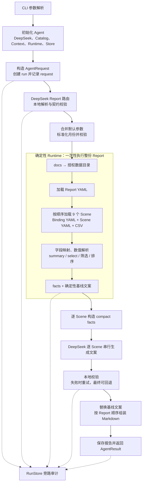

# Template Analysis Agent v6 端到端执行链路

本文说明从仓库根目录执行以下命令时，`template-analysis-agent-v6` 如何把自然语言请求转换为一份月度业绩分析报告，以及每个阶段的主要输入、处理和输出。

```powershell
.venv\Scripts\python.exe template-analysis-agent-v6\standalone_agent.py `
  "请基于当前数据生成五月业绩分析报告" `
  --data-context-id docs
```

本文描述的是**未传入 `--offline`、未传入 `--stream`、未传入 `--session-id`、未传入 `--data-dir`**的在线成功路径。此时系统使用 DeepSeek 完成 Report 路由和 Scene 文案生成，但原始 CSV 的读取与全部事实计算仍由本地确定性 Runtime 完成。

## 1. 本文样例来源

文中的业务数值、状态、耗时和结果片段来自一次已经落盘的真实成功运行：

```text
run_id:       20260813-011236-743-a514b006
运行目录:     template-analysis-agent-v6/runs/20260813-011236-743-a514b006/
开始时间:     2026-08-13 09:12:36.744952 +08:00
结束时间:     2026-08-13 09:15:14.453923 +08:00
端到端耗时:   157.709 秒
最终状态:     completed
模型:         deepseek-v4-flash
```

标注为“真实落盘片段”的示例直接取自该 run；标注为“按代码构造”的示例用于解释内存中的调用参数，因为当前系统不会保存原始 DeepSeek 请求与响应。

## 2. 一眼看懂主链路



可以把主链路压缩成一句话：

> 自然语言请求 → 选择已注册的整份 Report → 绑定五月参数 → 将 `docs` 解析为授权目录 → 确定性计算九个 Scene 的 facts → 基于 compact facts 生成九段文案 → 组装并保存 Markdown。

有两个关键边界：

- DeepSeek 只参与 **Report 路由**和**Scene 文案组织**；
- DeepSeek 不读取原始 CSV，不执行指标计算、阈值比较、机构筛选或排序。

## 3. 阶段总览

| 阶段 | 执行组件 | 主要输入 | 主要输出 |
| --- | --- | --- | --- |
| 0. CLI 解析 | `standalone_agent.py` | 命令行参数 | `argparse.Namespace` |
| 1. Agent 初始化 | `initialize_agent()` | `.env`、Report 目录、默认 `docs/` | `TemplateAnalysisAgent` 及其依赖 |
| 2. 请求与 run 创建 | `TemplateAnalysisAgent.events()` | `AgentRequest` | `run_id`、`request.json`、首批事件 |
| 3. Report 路由 | `IntentRouter` + DeepSeek | 用户消息、Catalog 候选摘要 | `RouteDecision`、`route.json` |
| 4. 参数绑定 | `ParameterBinder` | Report 默认参数、路由提取参数、Session | 标准化后的 `BoundParameters` |
| 5. 数据上下文解析 | `DataContextRegistry` | `data_context_id=docs` | 授权的物理数据目录 |
| 6. 确定性执行 | `ReportExecutionTool` + Runtime | Report、Scene、Binding、九张 CSV | 整份 Report 的 facts 和基线文案 |
| 7. facts 审计 | `RunStore` | 确定性执行结果 | `facts.json`、九个 facts-ready 事件 |
| 8. Scene 文案 | `SceneAnalyzer` + DeepSeek | 每个 Scene 的 compact facts | 九个经校验的文案或回退文案 |
| 9. 报告组装 | `ReportAssembler` + Runtime renderer | facts、九段最终文案 | Markdown 字符串 |
| 10. 完成与退出 | Engine + CLI | Markdown、warnings | `report.md`、`AgentResult`、退出码 |

## 4. 阶段 0：CLI 参数解析

### 4.1 输入

PowerShell 将参数传给 `standalone_agent.py`：

```text
argv[0] = template-analysis-agent-v6/standalone_agent.py
argv[1] = 请基于当前数据生成五月业绩分析报告
argv[2] = --data-context-id
argv[3] = docs
```

反引号只是 PowerShell 的续行符，不会作为参数传入 Python。若命令写在一行，可以直接执行：

```powershell
.venv\Scripts\python.exe template-analysis-agent-v6\standalone_agent.py "请基于当前数据生成五月业绩分析报告" --data-context-id docs
```

### 4.2 处理

`main()` 使用 `argparse` 解析参数。由于命令没有提供其他可选项，关键值如下。

### 4.3 输出示例（按代码构造）

```python
Namespace(
    message="请基于当前数据生成五月业绩分析报告",
    data_context_id="docs",
    data_dir=None,
    session_id=None,
    offline=False,
    stream=False,
)
```

这几个默认值决定后续行为：

- `offline=False`：创建 `DeepSeekLLMClient`，不是 `FakeLLMClient`；
- `stream=False`：终端最终只打印 `AgentResult`，中间事件不逐行打印；
- `session_id=None`：本次不复用、也不持久保存进程内 Session 状态；
- `data_dir=None`：不覆盖 context 映射，使用初始化时自动注册的默认 `docs/`。

## 5. 阶段 1：初始化 Agent

### 5.1 输入

```python
initialize_agent(
    data_contexts={},
    offline=False,
)
```

### 5.2 处理

`initialize_agent()` 按以下顺序装配运行依赖：

1. 从仓库根目录 `.env` 加载环境变量；
2. 读取 `DEEPSEEK_API_KEY`、`DEEPSEEK_MODEL` 和 `DEEPSEEK_BASE_URL`；
3. 创建两个 DeepSeek 调用端：温度为 `0` 的路由模型和温度为 `0.1` 的文案模型；
4. 若仓库根目录存在 `docs/`，自动注册 `docs → <repository-root>/docs`；
5. 动态加载 `monthly_analysis.execute_report` 和 `render_markdown`；
6. 扫描 `references/reports/*.yaml`，构造 `ReportCatalog`；
7. 创建参数绑定器、报告执行工具、Scene 分析器、报告组装器、RunStore 和内存 SessionStore；
8. 将这些组件注入 `TemplateAnalysisAgent`。

默认数据目录只能位于仓库根目录或其子目录中。注册时会解析绝对路径并检查目录存在性与授权根范围。

### 5.3 Catalog 输出示例（按代码构造，已裁剪）

当前 Catalog 只有一份完整 Report：

```json
{
  "id": "monthly-performance",
  "title": "{report_month}业绩分析报告",
  "scenario_desc": "基于月度经营 CSV 生成包含业绩、人力、主管、组织和增员等场景的综合分析报告。",
  "parameters": {
    "report_month": "五月",
    "month_label": "5月",
    "quarter_label": "二季度"
  },
  "scene_ids": [
    "standard-premium",
    "value",
    "active-manpower",
    "sunshine-manpower",
    "supervisor-activity",
    "supervisor-double-star",
    "standard-team",
    "recruitment",
    "co-recruitment"
  ]
}
```

### 5.4 本阶段输出

本阶段输出是装配完成的 `TemplateAnalysisAgent` 对象，尚未创建 run 目录。

如果 API key 缺失、DeepSeek 依赖无法导入、Report YAML 无法加载或默认数据目录注册失败，异常发生在 Engine 的主保护区之前，因此通常不会生成 `run_id`、`failed` 或 `done` 事件。

## 6. 阶段 2：构造请求并创建 run

### 6.1 输入

`main()` 构造不可变的 `AgentRequest`：

```python
AgentRequest(
    message="请基于当前数据生成五月业绩分析报告",
    session_id=None,
    data_context_id="docs",
)
```

随后非流式入口调用：

```python
result = agent.chat(request)
```

### 6.2 处理

`agent.chat()` 消费 `agent.events()` 产生的全部事件，并在遇到 `done` 时从事件中还原最终 `AgentResult`。

`events()` 首先：

1. 生成 UTC 时间戳加随机后缀组成的 `run_id`；
2. 创建 `template-analysis-agent-v6/runs/<run_id>/`；
3. 写入 `request.json`；
4. 追加 `request_received` 事件；
5. 读取 Session。由于 `session_id=None`，得到空的 `SessionState`。

### 6.3 输出示例（真实落盘片段）

本次生成：

```text
run_id = 20260813-011236-743-a514b006
```

`request.json`：

```json
{
  "message": "请基于当前数据生成五月业绩分析报告",
  "session_id": null,
  "data_context_id": "docs"
}
```

`events.jsonl` 的第一行：

```json
{"type":"request_received","run_id":"20260813-011236-743-a514b006","data":{},"timestamp":"2026-08-13T01:12:36.744952+00:00"}
```

事件时间使用 UTC；这里的 `01:12:36` 对应北京时间 `09:12:36`。

## 7. 阶段 3：选择整份 Report

### 7.1 输入

`IntentRouter` 将以下信息交给 DeepSeek 路由模型：

- 用户原始消息；
- `ReportCatalog.summaries()` 返回的候选 Report 摘要；
- 空的 `pending_report_id`；
- 空的 `pending_parameters`；
- 规定的 JSON 输出结构。

DeepSeek 输入示例（按代码构造，已裁剪）：

```json
{
  "message": "请基于当前数据生成五月业绩分析报告",
  "candidates": [
    {
      "id": "monthly-performance",
      "title": "{report_month}业绩分析报告",
      "intent_examples": [
        "生成五月业绩分析报告",
        "看一下本月经营情况",
        "做一份月度经营复盘"
      ],
      "scene_ids": [
        "standard-premium",
        "value",
        "...共 9 个 Scene"
      ]
    }
  ],
  "pending_report_id": null,
  "pending_parameters": [],
  "output_schema": {
    "action": "execute | clarify | unsupported",
    "report_id": "candidate id or null",
    "confidence": "number from 0 to 1",
    "extracted_params": "object using only params_schema names"
  }
}
```

### 7.2 处理

DeepSeek 返回 JSON 后，本地 Router 继续执行契约校验：

- `action` 只能是 `execute`、`clarify` 或 `unsupported`；
- `confidence` 必须位于 `[0, 1]`；
- 非空 `report_id` 必须存在于 Catalog；
- `execute` 必须携带 `report_id`；
- `execute` 的置信度必须达到 `0.7`，否则转为 `clarify`。

模型或契约失败时，Engine 最多进行两次路由尝试。

### 7.3 输出示例（真实落盘片段）

```json
{
  "action": "execute",
  "report_id": "monthly-performance",
  "confidence": 0.98,
  "extracted_params": {
    "report_month": "五月",
    "month_label": "5月"
  },
  "missing_params": [],
  "clarification": null,
  "reason": "用户明确指定五月，匹配月度业绩分析报告，月份参数已提取。",
  "duration_ms": 17054.18,
  "model": "deepseek-v4-flash"
}
```

对应事件为：

```text
route_started
route_selected(report_id=monthly-performance, confidence=0.98)
```

注意：路由单位是**整份 Report**。Router 选择 `monthly-performance` 后，后续固定执行其中声明的九个 Scene，不会根据这条请求临时裁剪或拼接 Scene。

## 8. 阶段 4：绑定与标准化参数

### 8.1 输入

参数绑定器接收三组值：

```json
{
  "report_defaults": {
    "report_month": "五月",
    "month_label": "5月",
    "quarter_label": "二季度"
  },
  "route_extracted": {
    "report_month": "五月",
    "month_label": "5月"
  },
  "session_parameters": {}
}
```

### 8.2 处理

`ParameterBinder` 执行：

1. 拒绝 `params_schema` 白名单之外的参数；
2. 按“Report 默认值 → Session 值 → 当前路由提取值”的优先级合并；
3. 将 `五月` 与 `5月` 标准化为同一月份对；
4. 检查两个显式月份输入是否冲突；
5. 检查 `required` 参数是否缺失；
6. 只保留 schema 中声明的参数。

用户没有显式提供季度，因此 `quarter_label` 沿用 Report 默认值 `二季度`。

### 8.3 输出示例（真实落盘片段）

```json
{
  "quarter_label": "二季度",
  "report_month": "五月",
  "month_label": "5月"
}
```

绑定后的值被追加到同一个 `route.json` 的 `bound_parameters` 字段，并产生：

```json
{
  "type": "parameters_bound",
  "data": {
    "parameters": {
      "quarter_label": "二季度",
      "report_month": "五月",
      "month_label": "5月"
    }
  }
}
```

## 9. 阶段 5：解析数据上下文

### 9.1 输入

```text
request.data_context_id = docs
session.data_context_id = null
```

Engine 优先使用本轮请求中的 context，因此：

```text
active_data_context = docs
```

### 9.2 处理

`ReportExecutionTool` 首先确认参数都属于 Report schema，然后调用：

```python
data_dir = DataContextRegistry.resolve("docs")
```

### 9.3 输出示例（本次实际解析结果）

```text
data_context_id: docs
data_dir:        D:\Code\Data Agent\Life_Insurance_Operating_Agent\docs
```

对应事件：

```json
{
  "type": "report_execution_started",
  "data": {
    "report_id": "monthly-performance",
    "data_context_id": "docs"
  }
}
```

LLM 只看到 context ID 和后续裁剪后的 facts；它不会收到这个目录中的原始 CSV 内容。

## 10. 阶段 6：确定性执行整份 Report

### 10.1 Runtime 输入

`ReportExecutionTool.execute()` 最终调用：

```python
execute_report(
    report_path=(
        "template-analysis-agent-v6/skills/monthly-performance-analysis/"
        "references/reports/monthly-performance.yaml"
    ),
    data_dir="docs",
    runtime_parameters={
        "quarter_label": "二季度",
        "report_month": "五月",
        "month_label": "5月",
    },
)
```

### 10.2 Report、Scene 与 Binding 如何协作

三类 YAML 的职责分别是：

- Report：声明报告标题、参数、Binding ID、九个 Scene 及顺序；
- Scene：声明指标语义、阈值、`summary` / `select` 动作、筛选与排序规则；
- Binding：声明 CSV 文件、总计行、组织列，以及语义字段到物理列的映射。

本次 Report 顺序和对应 CSV 如下：

| 顺序 | Scene ID | 标题 | CSV | facts action ID |
| ---: | --- | --- | --- | --- |
| 1 | `standard-premium` | 标保 | `标保.csv` | `overall`、`high_month_rate`、`low_month_rate`、`ahead_year_progress`、`behind_year_progress` |
| 2 | `value` | 价值 | `价值.csv` | `overall`、`high_month_rate`、`low_month_rate` |
| 3 | `active-manpower` | 活动人力 | `活动人力.csv` | `overall`、`high_activity_rate`、`target_met`、`low_activity_rate` |
| 4 | `sunshine-manpower` | 阳光人力 | `阳光人力.csv` | `overall`、`high_sunshine_rate`、`low_sunshine_rate` |
| 5 | `supervisor-activity` | 主管活动 | `主管活动.csv` | `overall`、`high_activity_rate`、`low_activity_rate` |
| 6 | `supervisor-double-star` | 主管双星 | `主管双星.csv` | `overall`、`high_double_star_rate`、`low_double_star_rate` |
| 7 | `standard-team` | 标准组 | `标准组.csv` | `overall`、`low_standard_yoy`、`low_standard_share` |
| 8 | `recruitment` | 新增 | `新增.csv` | `overall`、`high_added_rate`、`target_met`、`low_added_rate`、4 个本科差额 action |
| 9 | `co-recruitment` | 同引 | `同引.csv` | `overall`、`target_met`、`high_quarter_rate`、`month_training_zero`、`quarter_achieved_zero` |

### 10.3 单个 Scene 的输入示例：标保

Binding 将语义字段映射到五月物理列：

```yaml
standard-premium:
  file: 标保.csv
  organization_column: 机构
  total_row: {column: 片区, value: 全系统}
  fields:
    month_amount: "{month_label}达成"
    month_rate: "{month_label}达成率"
    month_yoy: "{month_label}同比"
    year_amount: 全年标保达成
    year_progress: 全年进度
    year_yoy: 全年同比
```

参数替换后，Runtime 实际查找 `5月达成`、`5月达成率` 和 `5月同比` 等列。

Scene 中的一条筛选规则为：

```yaml
- id: high_month_rate
  type: select
  where: {field: month_rate, operator: ">", value: "${high_rate}"}
  order_by: {field: month_rate, direction: desc}
  display_field: month_rate
```

其中 `high_rate=70`，所以 Runtime 选择 `month_rate > 70` 的非总计机构，并按 `month_rate` 降序排列。

### 10.4 Runtime 内部处理

对每个 Scene，Runtime 串行执行：

1. 读取 CSV，裁剪表头和单元格空白；
2. 检查重复表头和行列数；
3. 用 Binding 找到组织列、总计行和物理指标列；
4. 将百分比、`pt`、数字、空值等单元格解析为 `{value, display}`；
5. `summary` 从唯一总计行取事实；
6. `select` 排除总计行与空机构，执行阈值比较和排序；
7. 保存完整 facts；
8. 基于同一 facts 生成不依赖 LLM 的基线文案。

### 10.5 单个 Scene 输出示例（真实 `facts.json` 片段，已裁剪）

```json
{
  "scene_id": "standard-premium",
  "title": "标保",
  "source": "D:\\Code\\Data Agent\\Life_Insurance_Operating_Agent\\docs\\标保.csv",
  "facts": {
    "overall": {
      "month_amount": {"value": 12444, "display": "12444"},
      "month_rate": {"value": 61.8, "display": "61.8%"},
      "month_yoy": {"value": -11.6, "display": "-11.6%"},
      "year_amount": {"value": 100538, "display": "100538"},
      "year_progress": {"value": 53.8, "display": "53.8%"},
      "year_yoy": {"value": 20.6, "display": "20.6%"}
    },
    "high_month_rate": [
      {
        "organization": "新疆",
        "values": {
          "month_rate": {"value": 176.3, "display": "176.3%"}
        }
      },
      {
        "organization": "天津",
        "values": {
          "month_rate": {"value": 107.4, "display": "107.4%"}
        }
      }
    ]
  },
  "narrative": "- 全系统概况：月度标保达成 12444万；月度标保达成率 61.8%；……"
}
```

完整 `high_month_rate` 实际包含 9 家机构；上面只展示前两条。`facts.json` 中的 select 行还保留该 Scene 的所有映射指标，而后续交给模型的 compact facts 只保留文案所需的展示字段。

### 10.6 整份 Runtime 输出示例（真实落盘结构，已裁剪）

```json
{
  "report_id": "monthly-performance",
  "title": "五月业绩分析报告",
  "parameters": {
    "report_month": "五月",
    "month_label": "5月",
    "quarter_label": "二季度"
  },
  "output": {
    "format": "markdown",
    "heading_level": 1
  },
  "scenes": [
    {"scene_id": "standard-premium", "title": "标保", "facts": {}, "narrative": "..."},
    {"scene_id": "value", "title": "价值", "facts": {}, "narrative": "..."},
    {"scene_id": "...", "title": "...", "facts": {}, "narrative": "..."},
    {"scene_id": "co-recruitment", "title": "同引", "facts": {}, "narrative": "..."}
  ]
}
```

本次完整 `facts.json` 为 197,261 字节。

## 11. 阶段 7：保存 facts 并发布事实事件

### 11.1 输入

输入是 `execute_report()` 一次性返回的整份确定性结果。

### 11.2 输出

Engine 先将结果完整写入：

```text
template-analysis-agent-v6/runs/20260813-011236-743-a514b006/facts.json
```

然后遍历返回值中的九个 Scene，连续追加九个 `scene_facts_ready` 事件。

真实事件示例：

```json
{"type":"scene_facts_ready","data":{"scene_id":"standard-premium","duration_ms":45.24}}
{"type":"scene_facts_ready","data":{"scene_id":"value","duration_ms":45.24}}
{"type":"scene_facts_ready","data":{"scene_id":"co-recruitment","duration_ms":45.24}}
```

这里有一个重要时序细节：

- Runtime 先在一次 `execute_report()` 调用中算完整份 Report；
- Engine 收到完整结果后，才批量发出九个 facts-ready 事件；
- 每个事件中的 `45.24 ms` 都是**整份九场景确定性执行的总耗时**，不是该 Scene 的独立耗时；
- 因而不能把九个 `45.24 ms` 相加。

## 12. 阶段 8：逐 Scene 生成并校验文案

九个 Scene 按 Report 顺序串行分析，不并行。

### 12.1 构造 compact facts

对每个 Scene，Engine 重新加载 Scene YAML，并调用 `build_scene_context()`。该函数将完整 facts 裁剪为模型写文案所需的最小上下文。

对于 `summary`，保留：

- fact ID；
- 指标 label 和 unit；
- 解析后的 `value`；
- 必须照抄的 `display`。

对于 `select`，每一行只保留：

- `organization`；
- `display_field` 的 `value`；
- `display_field` 的 `display`。

不会把原始 CSV、物理列名、整行其他字段或源文件内容交给 DeepSeek。

### 12.2 SceneAnalyzer 输入示例（按代码构造，已裁剪）

```json
{
  "scene_id": "standard-premium",
  "title": "标保",
  "description": "分析月度标保达成、同比表现和年度进度，识别领先与落后机构。",
  "narrative_instruction": {
    "objective": "概括全系统标保表现，并指出月度达成和年度进度明显领先或落后的机构。",
    "style": "使用简洁的经营分析语言，先整体、后机构；只引用执行结果中的数字。"
  },
  "report_parameters": {
    "quarter_label": "二季度",
    "report_month": "五月",
    "month_label": "5月"
  },
  "facts": {
    "overall": {
      "type": "summary",
      "values": {
        "month_rate": {
          "label": "月度标保达成率",
          "unit": "",
          "value": 61.8,
          "display": "61.8%"
        }
      }
    },
    "high_month_rate": {
      "type": "select",
      "display_field": "month_rate",
      "rows": [
        {"organization": "新疆", "value": 176.3, "display": "176.3%"},
        {"organization": "天津", "value": 107.4, "display": "107.4%"}
      ]
    }
  },
  "baseline_narrative": "- 全系统概况：月度标保达成 12444万；……"
}
```

`baseline_narrative` 保留在本地 context 中用于回退；组装 DeepSeek payload 时会被移除。

### 12.3 DeepSeek 输出契约

DeepSeek 必须返回一个 JSON 对象：

```json
{
  "scene_id": "standard-premium",
  "content": "非空 Markdown 文案",
  "used_fact_ids": ["overall", "high_month_rate"],
  "warnings": []
}
```

### 12.4 本地校验与回退

模型返回后，`SceneAnalyzer` 在本地检查：

- `scene_id` 必须与当前 Scene 一致；
- `content` 不得为空；
- `used_fact_ids` 至少有一个；
- 引用的 fact ID 必须存在于 compact facts；
- 形如“机构（数字）”的机构名不得超出 compact facts 中的机构集合。

一次调用失败后会把错误反馈给模型并重试，最多尝试两次。两次都失败时，不终止整份报告，而是使用 Runtime 已生成的 `baseline_narrative`，记录 warning，并在事件流写入 `scene_analysis_fallback`。

### 12.5 单个 Scene 输出示例（真实 `narratives.json` 片段）

```json
{
  "scene_id": "standard-premium",
  "content": "- 全系统5月标保达成12444万，达成率61.8%，同比-11.6%；全年标保达成100538万，进度53.8%，同比20.6%。\n- 月度标保达成率领先机构：新疆176.3%、天津107.4%、潍坊94.7%、云南91.4%、海南79.7%、河南78.7%、内蒙古74.1%、宁波73.8%、甘肃72.8%。\n- 月度标保达成率落后机构：深圳4.2%、北京27.5%、宁夏29.0%、青岛29.3%、上海39.9%、山西41.6%、安徽42.8%、贵州43.3%。\n- 全年标保进度领先机构：宁波83.2%、新疆71.9%、贵州65.8%、潍坊63.8%、天津63.7%、甘肃62.6%、云南60.7%。\n- 全年标保进度落后机构：深圳21.6%、北京39.6%、青岛41.2%、宁夏41.6%、海南42.5%、安徽43.2%。",
  "used_fact_ids": [
    "overall",
    "high_month_rate",
    "low_month_rate",
    "ahead_year_progress",
    "behind_year_progress"
  ],
  "warnings": [],
  "used_fallback": false,
  "duration_ms": 15566.62
}
```

### 12.6 九个 Scene 的真实执行结果

| 顺序 | Scene | 文案耗时 | 是否回退 |
| ---: | --- | ---: | --- |
| 1 | `standard-premium` | 15,566.62 ms | 否 |
| 2 | `value` | 7,437.28 ms | 否 |
| 3 | `active-manpower` | 4,196.02 ms | 否 |
| 4 | `sunshine-manpower` | 2,617.85 ms | 否 |
| 5 | `supervisor-activity` | 11,986.71 ms | 否 |
| 6 | `supervisor-double-star` | 8,666.04 ms | 否 |
| 7 | `standard-team` | 15,609.11 ms | 否 |
| 8 | `recruitment` | 30,815.20 ms | 否 |
| 9 | `co-recruitment` | 43,656.63 ms | 否 |

本次每个 Scene 都产生 `scene_analysis_ready`，没有 `scene_analysis_fallback`，因此最终 warning 列表为空。

所有 Scene 完成后写入：

```text
narratives.json
```

该文件保存模型名、每个 Scene 的最终结构化文案、使用的 fact IDs、是否回退和耗时，但不保存原始模型 prompt、原始 response 或每次重试的完整详情。

## 13. 阶段 9：组装 Markdown 报告

### 13.1 输入

`ReportAssembler.render()` 接收：

1. 确定性 Runtime 返回的完整 Report 结果；
2. 以 `scene_id` 为 key 的九个 `SceneNarrativeResult`。

输入关系可以表示为：

```text
deterministic_result.scenes[i].facts      保留不变
deterministic_result.scenes[i].narrative  替换为最终 Scene 文案
```

### 13.2 处理

组装器复制确定性结果，按 Report 中既定的九个 Scene 顺序替换 narrative，然后调用 Runtime 的 `render_markdown()`：

- Report 标题使用一级标题；
- Scene 标题使用二级标题；
- Scene 内容使用最终的 DeepSeek 文案或回退文案；
- 任意 Scene 缺少最终文案都会失败；
- 当前只支持 `output.format=markdown`。

### 13.3 输出示例（真实 `report.md` 开头）

```markdown
# 五月业绩分析报告

## 标保

- 全系统5月标保达成12444万，达成率61.8%，同比-11.6%；全年标保达成100538万，进度53.8%，同比20.6%。
- 月度标保达成率领先机构：新疆176.3%、天津107.4%、潍坊94.7%、云南91.4%、海南79.7%、河南78.7%、内蒙古74.1%、宁波73.8%、甘肃72.8%。
- 月度标保达成率落后机构：深圳4.2%、北京27.5%、宁夏29.0%、青岛29.3%、上海39.9%、山西41.6%、安徽42.8%、贵州43.3%。

## 价值

- 全系统5月价值达成7045万，月度达成率74.1%，同比增长9.8%；全年价值进度54.2%，全年同比增长7.2%。
```

完整报告被写入：

```text
template-analysis-agent-v6/runs/20260813-011236-743-a514b006/report.md
```

## 14. 阶段 10：完成、终端输出与退出码

### 14.1 状态判定

Engine 根据 Scene warning 判定最终状态：

```text
warnings 为空      → completed
warnings 非空      → completed_with_warnings
```

本次九个 Scene 均未回退，因此：

```text
status = completed
```

### 14.2 Session 处理

成功后 Engine 会准备保存：

```json
{
  "report_id": "monthly-performance",
  "parameters": {
    "quarter_label": "二季度",
    "report_month": "五月",
    "month_label": "5月"
  },
  "pending_parameters": [],
  "data_context_id": "docs"
}
```

但本次 `session_id=None`，`InMemorySessionStore.save()` 不执行实际写入。即使提供了 `--session-id`，CLI 进程退出后内存 Session 也不会跨进程保留。

### 14.3 最后两个事件（真实含义）

```text
report_ready(report_path=..., status=completed)
done(result=<完整 AgentResult>)
```

### 14.4 终端输出示例（由真实 `done` 结果还原）

由于没有 `--stream`，中间 34 个事件不会打印到终端。CLI 最终打印：

```json
{
  "status": "completed",
  "message": "报告已生成。",
  "run_id": "20260813-011236-743-a514b006",
  "report_id": "monthly-performance",
  "parameters": {
    "quarter_label": "二季度",
    "report_month": "五月",
    "month_label": "5月"
  },
  "facts_path": "D:\\Code\\Data Agent\\Life_Insurance_Operating_Agent\\template-analysis-agent-v6\\runs\\20260813-011236-743-a514b006\\facts.json",
  "report_path": "D:\\Code\\Data Agent\\Life_Insurance_Operating_Agent\\template-analysis-agent-v6\\runs\\20260813-011236-743-a514b006\\report.md",
  "warnings": []
}
```

`completed` 和 `completed_with_warnings` 的 CLI 退出码都是 `0`；其他 Agent 结果状态返回 `1`。命令行语法错误由 `argparse` 返回 `2`。

## 15. 本次 run 的完整产物

```text
template-analysis-agent-v6/runs/20260813-011236-743-a514b006/
├─ request.json       # 原始请求、Session ID、数据上下文 ID
├─ route.json         # 路由决定、模型、耗时、最终绑定参数
├─ facts.json         # 九个 Scene 的确定性事实和基线文案
├─ narratives.json    # 九个最终文案、fact 引用、耗时、回退状态
├─ report.md          # 最终 Markdown 报告
└─ events.jsonl       # 34 条阶段事件
```

本次文件大小：

| 文件 | 大小 |
| --- | ---: |
| `request.json` | 127 B |
| `route.json` | 517 B |
| `facts.json` | 197,261 B |
| `narratives.json` | 7,521 B |
| `report.md` | 4,910 B |
| `events.jsonl` | 6,655 B |

## 16. 本次真实事件时序

事件主序列如下：

```text
request_received
→ route_started
→ route_selected
→ parameters_bound
→ report_execution_started
→ scene_facts_ready × 9
→ (
     scene_analysis_started
     → scene_analysis_ready
  ) × 9
→ report_ready
→ done
```

共 34 条事件：

```text
1 + 1 + 1 + 1 + 1 + 9 + 18 + 1 + 1 = 34
```

实测关键耗时：

| 环节 | 耗时 |
| --- | ---: |
| Report 路由 | 17.054 秒 |
| 九场景确定性 facts 计算 | 0.045 秒 |
| 九场景文案阶段合计 | 约 140.551 秒 |
| 完整事件区间 | 157.709 秒 |

文案耗时合计与完整耗时不是严格可加关系，计时点之间还包含上下文构建、本地校验、事件写入、文件写入和报告组装等少量开销。

## 17. 非成功主链路如何结束

虽然本次真实 run 成功，理解以下分支有助于排查其他运行。

| 发生位置 | 典型原因 | 结果 |
| --- | --- | --- |
| Agent 初始化前后 | API key 缺失、依赖缺失、Report 目录无效 | 直接抛异常；可能没有 `run_id` |
| 路由 | 无匹配完整 Report | `unsupported`，退出码 1 |
| 路由 | 低置信度或需要确认 | `needs_input`，退出码 1 |
| 参数绑定 | 月份冲突、必填参数缺失 | `needs_input`，退出码 1 |
| 数据上下文 | 未提供或未知 context ID | `needs_input` 或 `failed`，退出码 1 |
| 确定性 Runtime | CSV 缺失、列缺失、总计行异常、类型不可比较 | `failed`，退出码 1 |
| 单个 Scene 文案 | 两次模型/契约校验均失败 | 回退基线文案；整份报告通常为 `completed_with_warnings`，退出码 0 |
| 报告组装或落盘 | 缺文案、不支持输出格式、I/O 异常 | `failed`，退出码 1 |

只要异常发生在 run 已创建且进入 Engine 主保护区之后，系统通常会尽力追加 `failed` 和 `done` 事件，并保留失败前已经写入的文件。

## 18. 审计边界与复现限制

`runs/<run_id>/` 提供的是结果级审计，而不是严格的输入快照。本次 run 可以回答：

- 用户请求和数据 context 是什么；
- 选择了哪份 Report、提取并绑定了哪些参数；
- 确定性 facts 是什么；
- 每个 Scene 最终采用了什么文案、是否回退；
- 最终报告是什么；
- 执行在哪些阶段完成或失败。

但当前不会落盘：

- 原始 CSV 和 YAML 的内容哈希或修改时间；
- 每个 Scene 最终生效的完整阈值、筛选和排序谓词快照；
- DeepSeek 的原始请求、原始响应以及每次重试详情；
- Python 依赖锁定快照和进程环境快照。

因此，`run.md` 中关于模型输入的示例是按当前代码构造的契约示例；仅凭某个历史 run 目录不能严格复现当时的全部输入版本。

## 19. 对照代码的推荐阅读顺序

1. `template-analysis-agent-v6/standalone_agent.py`：CLI、初始化和顶层入口；
2. `template-analysis-agent-v6/agent/engine.py`：完整串行编排、事件和早停分支；
3. `template-analysis-agent-v6/agent/router.py`：Report 路由校验与月份参数绑定；
4. `template-analysis-agent-v6/agent/tools.py`：数据上下文解析和 Report 执行边界；
5. `template-analysis-agent-v6/skills/monthly-performance-analysis/references/reports/monthly-performance.yaml`：九个 Scene 的组成和顺序；
6. `template-analysis-agent-v6/skills/monthly-performance-analysis/references/bindings/monthly-csv.yaml`：CSV 与语义字段映射；
7. `template-analysis-agent-v6/skills/monthly-performance-analysis/references/scenes/*.yaml`：阈值、事实动作和文案目标；
8. `template-analysis-agent-v6/skills/monthly-performance-analysis/scripts/monthly_analysis/runtime.py`：确定性 CSV 解释器；
9. `template-analysis-agent-v6/agent/analyzer.py`：compact facts、文案校验、重试和回退；
10. `template-analysis-agent-v6/agent/llm.py`：DeepSeek 请求契约；
11. `template-analysis-agent-v6/agent/store.py`：run 目录、事件和 Session 行为。
