# 模板分析 Agent V3

V3 是一个本地、可审计的模板驱动经营分析原型。它限制意图路由和自然语言生成的范围，同时将数据读取、标准化、计算、校验和报告组装保持为确定性流程。

```mermaid
flowchart LR
    Q["AnalysisRequest"] --> R["IntentRouter"]
    R --> D["RoutingDecision"]
    D --> C["PlanCompiler"]
    C --> P["CompiledAnalysisPlan"]
    P --> X["QueryExecutor + DataAdapter"]
    X --> N["CanonicalDataset"]
    N --> A["DeterministicAnalyzer"]
    A --> F["FactBundle"]
    F --> E["ExpressionProvider"]
    E --> V["NarrativeValidator"]
    V --> O["ReportAssembler + AuditRecorder"]
```



路由器不会创建分析步骤，`PlanCompiler` 只展开已注册的模板。表达器接收的是 `FactBundle`，而不是原始 CSV 数据。

## 目录结构

- `src/template_analysis_agent/`：应用服务、公共契约、注册表、适配器、确定性处理器、表达器、校验、报告组装、审计和 CLI。
- `configs/data_queries/`：受控的数据查询契约。
- `configs/data_source_profiles/`：CSV 物理字段映射和行选择规则。
- `skills/monthly-performance-analysis/`：月度业绩分析 Skill，包含九个场景、报告配方、语义指标、风格、术语表和成对示例。
- `tests/`：离线单元测试、安全测试、端到端测试和 V2 事实等价性测试。

## 安装

在仓库根目录执行：

```powershell
.\.venv\Scripts\python.exe -m pip install -e .\template-analysis-agent-v3
```

本项目要求 Python 3.11 或更高版本。

## 校验与检查

```powershell
template-analysis validate-template

template-analysis inspect-plan `
  --question "分析本月标保" `
  --scene standard-premium `
  --param data_month_name=5月 `
  --param cutoff_date=5月31日
```

也可以通过 Skill 包装脚本执行相同命令：

```powershell
.\.venv\Scripts\python.exe `
  .\template-analysis-agent-v3\skills\monthly-performance-analysis\scripts\run_analysis.py `
  validate-template
```

## 生成五月业绩报告

```powershell
template-analysis analyze `
  --question "生成五月业绩分析报告" `
  --report monthly-performance `
  --param report_month_name=五月 `
  --param data_month_name=5月 `
  --param quarter_name=二季度 `
  --param cutoff_date=5月31日 `
  --dataset standard_premium=docs\标保.csv `
  --dataset value=docs\价值.csv `
  --dataset active_manpower=docs\活动人力.csv `
  --dataset sunshine_manpower=docs\阳光人力.csv `
  --dataset supervisor_activity=docs\主管活动.csv `
  --dataset supervisor_double_star=docs\主管双星.csv `
  --dataset standard_team=docs\标准组.csv `
  --dataset recruitment=docs\新增.csv `
  --dataset co_recruitment=docs\同引.csv
```

默认表达器是确定性的，可在无网络环境下运行。若要使用 DeepSeek，请设置 `DEEPSEEK_API_KEY` 并传入 `--provider deepseek`。默认模型为 `deepseek-v4-flash`；设置 `DEEPSEEK_MODEL=deepseek-v4-pro` 可以在运行时切换模型。只有用户选择 DeepSeek 表达器时，歧义路由才会调用 DeepSeek。

## Python API

```python
from pathlib import Path

from template_analysis_agent import AnalysisApplication, AnalysisRequest
from template_analysis_agent.models import DataBinding

application = AnalysisApplication(Path("template-analysis-agent-v3"))
result = application.run(
    AnalysisRequest(
        question="分析本月标保",
        scene_ids=["standard-premium"],
        parameters={
            "data_month_name": "5月",
            "cutoff_date": "5月31日",
        },
        data_bindings={
            "standard_premium": DataBinding(source="docs/标保.csv")
        },
    )
)
print(result.report_markdown)
```

每次成功运行都会写入 `request.json`、`routing.json`、`plan.json`、`query-manifest.json`、`facts.json`、`model-response.json`、`validation.json` 和 `report.md`。查询审计数据同时包含已注册的查询契约和实际调用记录，以及数据源指纹、缓存状态、耗时和错误信息。

## 测试

```powershell
$env:PYTHONPATH=(Resolve-Path .\template-analysis-agent-v3\src).Path
.\.venv\Scripts\python.exe -m unittest discover `
  -s .\template-analysis-agent-v3\tests -v
```

回归测试会将五月报告的全部 73 个汇总/分类事实与 V2 context 进行比较，包括原始值、规则、阈值、数量和机构名单。除真实模型评测外，测试不需要网络访问。
