# Template Analysis Agent V3

V3 is a local, auditable prototype for template-driven operating analysis. It
keeps routing and prose generation constrained while making data access,
normalization, calculation, validation, and report assembly deterministic.

```mermaid
flowchart LR
    Q["AnalysisRequest"] --> R["IntentRouter"]
    R --> D["RoutingDecision"]
    D --> C["PlanCompiler"]
    C --> P["CompiledAnalysisPlan"]
    P --> X["QueryExecutor + DataAdapter"]
    X --> N["CanonicalDataset"]
    N --> A["DeterministicAnalyzer"]
    A --> F["FactBundle"]
    F --> E["ExpressionProvider"]
    E --> V["NarrativeValidator"]
    V --> O["ReportAssembler + AuditRecorder"]
```



The router never creates analysis steps. `PlanCompiler` expands only registered
templates. Expression providers receive `FactBundle`, not raw CSV data.

## Layout

- `src/template_analysis_agent/`: application, contracts, registries, adapters,
  deterministic handlers, expression, validation, reporting, and CLI.
- `configs/data_queries/`: controlled query contracts.
- `configs/data_source_profiles/`: physical CSV mappings and row selectors.
- `skills/monthly-performance-analysis/`: the monthly report Skill, nine scenes,
  report recipe, semantic metrics, style, glossary, and paired example.
- `tests/`: offline unit, safety, end-to-end, and V2 parity tests.

## Install

From the repository root:

```powershell
.\.venv\Scripts\python.exe -m pip install -e .\template-analysis-agent-v3
```

The package requires Python 3.11 or newer.

## Validate and inspect

```powershell
template-analysis validate-template

template-analysis inspect-plan `
  --question "分析本月标保" `
  --scene standard-premium `
  --param data_month_name=5月 `
  --param cutoff_date=5月31日
```

The same commands are available through the Skill wrapper:

```powershell
.\.venv\Scripts\python.exe `
  .\template-analysis-agent-v3\skills\monthly-performance-analysis\scripts\run_analysis.py `
  validate-template
```

## Run the May report

```powershell
template-analysis analyze `
  --question "生成五月业绩分析报告" `
  --report monthly-performance `
  --param report_month_name=五月 `
  --param data_month_name=5月 `
  --param quarter_name=二季度 `
  --param cutoff_date=5月31日 `
  --dataset standard_premium=docs\标保.csv `
  --dataset value=docs\价值.csv `
  --dataset active_manpower=docs\活动人力.csv `
  --dataset sunshine_manpower=docs\阳光人力.csv `
  --dataset supervisor_activity=docs\主管活动.csv `
  --dataset supervisor_double_star=docs\主管双星.csv `
  --dataset standard_team=docs\标准组.csv `
  --dataset recruitment=docs\新增.csv `
  --dataset co_recruitment=docs\同引.csv
```

The default expression provider is deterministic and works offline. To use
DeepSeek, set `DEEPSEEK_API_KEY` and pass `--provider deepseek`. The default
model is `deepseek-v4-flash`; set `DEEPSEEK_MODEL=deepseek-v4-pro` to switch at
runtime. Ambiguous routing uses DeepSeek only when the DeepSeek provider was
requested.

## Python API

```python
from pathlib import Path

from template_analysis_agent import AnalysisApplication, AnalysisRequest
from template_analysis_agent.models import DataBinding

application = AnalysisApplication(Path("template-analysis-agent-v3"))
result = application.run(
    AnalysisRequest(
        question="分析本月标保",
        scene_ids=["standard-premium"],
        parameters={
            "data_month_name": "5月",
            "cutoff_date": "5月31日",
        },
        data_bindings={
            "standard_premium": DataBinding(source="docs/标保.csv")
        },
    )
)
print(result.report_markdown)
```

Each successful run writes `request.json`, `routing.json`, `plan.json`,
`query-manifest.json`, `facts.json`, `model-response.json`, `validation.json`,
and `report.md`. Query audit data includes both the registered contracts and the
actual calls, source fingerprints, cache status, duration, and errors.

## Tests

```powershell
$env:PYTHONPATH=(Resolve-Path .\template-analysis-agent-v3\src).Path
.\.venv\Scripts\python.exe -m unittest discover `
  -s .\template-analysis-agent-v3\tests -v
```

The regression suite compares all 73 May summary/classification facts with the
V2 context, including values, rules, thresholds, counts, and organization
lists. It does not require network access.
