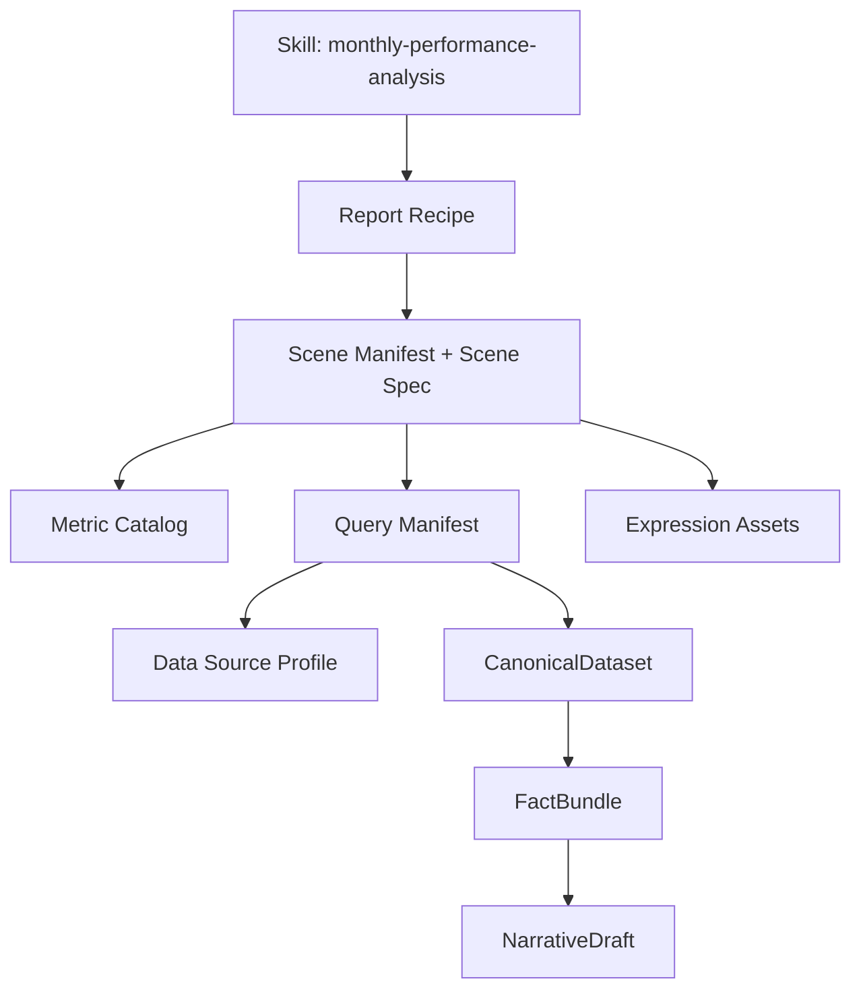

# 月度业绩分析模板设计文档

本文档说明 `monthly-performance-analysis` Skill 的模板模型、目录约定、配置边界和扩展流程。目标是让后续新增场景、替换数据源、调整表达风格和升级分析规则时，都能在明确的边界内完成，避免把取数逻辑、计算逻辑和文案逻辑重新混在一起。

本文档适用于 `template-analysis-agent-v3/skills/monthly-performance-analysis/` 下的模板，以及它引用的查询契约、数据源 profile 和表达资产。

## 1. 设计目标

模板系统遵循以下原则：

1. **模板描述分析意图，程序执行分析逻辑。** YAML 声明指标、步骤、条件、阈值和信号；Python 只执行已经注册的步骤处理器。
2. **数据源与模板解耦。** CSV 路径、物理列名、动态月份列和 TOTAL/DETAIL 规则只能放在数据源 profile 中。
3. **确定性计算与 LLM 表达分离。** 程序生成 `FactBundle`；LLM 只能把事实改写为自然语言，不能计算、取数、补充名单、解释原因或提出建议。
4. **每个事实可追溯。** 事实必须保留查询 ID、查询版本、来源行号、原始值和展示值。
5. **配置可校验。** 模板只能引用已注册的查询、指标、步骤、运算符和排序方式；非法配置在加载阶段失败。
6. **报告配方与场景解耦。** 场景可以单独运行，也可以由报告配方按顺序组合。

以下内容不属于本阶段模板：

- SQL、Python 表达式、`eval` 或 Jinja 模板；
- CSV 路径和物理列名；
- `prefix`、`suffix`、`subject`、`comparison`、`presentation` 等句子片段；
- 未注册的查询、计算函数或自由格式公式；
- 解释性原因、行动建议和无法由事实证明的趋势判断。

## 2. 模板的分层模型

一个月度报告由以下层次组成：



### 2.1 Skill

一个报告族对应一个 Skill。Skill 入口只负责：

- 说明何时使用该报告族；
- 指向场景、报告配方、查询契约、风格和示例；
- 说明执行边界和安全约束。

Skill 入口不保存九个场景的全部细节，也不直接编写业务计算。详细配置按需从 `assets/` 和 `configs/` 加载。

### 2.2 场景

场景是可独立执行的最小分析单元，例如标保、价值、活动人力、主管双星或新增。每个场景由两个文件组成：

- `manifest.yaml`：路由元数据；
- `scene.yaml`：确定性执行剧本。

场景 ID 必须稳定。ID 一旦被报告配方、查询契约、审计文件或外部调用引用，不应随意改名；如果分析含义发生破坏性变化，应新建 ID 或升级主版本。

### 2.3 报告配方

报告配方位于 `assets/reports/`，负责：

- 报告 ID、标题和触发问题；
- 报告级参数；
- 场景顺序；
- 场景是否必选；
- 报告级信号和 callout。

报告配方不复制场景步骤。场景顺序由配方控制，场景计算由 `scene.yaml` 控制。

### 2.4 查询契约

查询契约位于 `configs/data_queries/`，负责声明：

- 稳定的 `query_id` 和版本；
- 输入参数及类型；
- 规范输出 Schema 和数据粒度；
- 处理器类型及已注册处理器引用；
- 数据源和权限元数据；
- 超时和是否必需。

查询契约不保存 CSV 的物理列名。物理映射由 `profile_id` 指向的数据源 profile 负责。

### 2.5 数据源 profile

数据源 profile 位于 `configs/data_source_profiles/`，负责把一种物理数据布局转换为规范字段：

- 文件编码；
- 维度字段和物理列名；
- 动态月份列占位符；
- TOTAL 行识别规则；
- DETAIL 行的机构字段；
- 物理字段到规范指标 ID 的映射。

同一场景可以更换 profile 或数据适配器，而不需要修改场景步骤。

### 2.6 指标目录

指标目录位于 `assets/metrics/`，负责声明指标的业务语义：

- 指标 ID 和展示名称；
- 单位；
- 展示格式化器；
- 语义类型，如普通值、同比或目标差额；
- 允许的操作，如 `summarize`、`classify`。

指标 ID 是场景步骤和数据源 profile 之间的稳定接口。物理列名不是指标 ID。

### 2.7 表达资产

表达资产位于 `assets/styles/`、`assets/glossary.yaml` 和 `assets/examples/`：

- `style.yaml`：语气、标题、数字、名单和标点规范；
- `glossary.yaml`：业务术语和关系表达；
- `examples/`：`FactBundle JSON` 与目标 Markdown 的成对示例。

表达资产可以变化而不影响查询和确定性计算。

## 3. 目录约定

```text
template-analysis-agent-v3/
├── src/template_analysis_agent/
│   ├── models.py              # Pydantic 公共契约
│   ├── config.py              # YAML 加载与模板静态校验
│   ├── routing.py             # 路由与 PlanCompiler
│   ├── query.py               # 查询执行和数据适配器
│   ├── executor.py            # 确定性步骤处理器
│   ├── expression.py          # 确定性、Replay、DeepSeek 表达器
│   ├── validation.py          # 事实安全校验
│   ├── reporting.py           # 报告组装和审计
│   └── application.py         # 统一应用入口
├── configs/
│   ├── data_queries/          # 受控查询契约
│   └── data_source_profiles/  # 物理数据映射
├── skills/monthly-performance-analysis/
│   ├── SKILL.md
│   ├── agents/openai.yaml
│   ├── assets/
│   │   ├── scenes/             # 场景 manifest 和 scene spec
│   │   ├── reports/            # 报告配方
│   │   ├── metrics/            # 语义指标
│   │   ├── styles/             # 表达风格
│   │   ├── examples/           # FactBundle—Markdown 示例
│   │   └── glossary.yaml
│   ├── references/             # 设计和契约文档
│   └── scripts/run_analysis.py
└── tests/
```

## 4. 场景文件设计

### 4.1 `manifest.yaml`：负责路由，不负责执行

示例：

```yaml
id: standard-premium
version: 3.0.0
title: 标保
description: 汇总月度标保和年度进度，并按阈值识别机构表现。
keywords: [标保, 标准保费, 标保达成率, 全年标保进度]
questions:
  - 本月标保达成情况如何？
  - 哪些机构标保达标或进度偏低？
required_parameters: [data_month_name, cutoff_date]
```

字段约定：

| 字段 | 必填 | 说明 |
| --- | --- | --- |
| `id` | 是 | 稳定场景 ID，必须与目录名一致 |
| `version` | 是 | 场景版本 |
| `title` | 是 | 报告标题使用的名称 |
| `description` | 是 | 面向分析师的场景说明 |
| `keywords` | 否 | 关键词、别名和业务术语 |
| `questions` | 否 | 示例问法，用于路由匹配 |
| `required_parameters` | 否 | 路由阶段用于提示缺失参数 |

`manifest.yaml` 不应加入阈值、查询、指标或步骤。阈值和步骤属于 `scene.yaml`。

### 4.2 `scene.yaml`：唯一可执行来源

一个场景 spec 至少包含：

```yaml
scene_id: standard-premium
query_ref: monthly-performance.standard-premium
parameters:
  monthly_high_threshold:
    type: number
    default: 70
    description: 月度标保达成率较高阈值。
analysis_intent:
  - 汇总全系统月度标保总量、达成率、同比和年度进度。
steps:
  - id: overall_summary
    type: summarize
    metrics: [month_amount, month_rate, month_yoy]
  - id: monthly_rate_classification
    type: classify
    metric: month_rate
    display_order: source
    bands:
      - {id: high, operator: gt, threshold_param: monthly_high_threshold}
signals:
  target_met:
    from: {step: monthly_rate_classification, band: target_met}
expression:
  style_profile: monthly-operation-report
  example_tags: [summary, threshold-classification]
```

#### 参数

参数只描述场景逻辑需要的值。常见类型为 `string` 和 `number`：

- 必填参数必须由请求或报告配方提供；
- 有 `default` 的参数可以省略；
- 用户只能覆盖场景中声明的参数；
- 参数不能包含 SQL、公式或 Python 代码；
- 动态月份参数可以传给查询和数据源 profile，但不能直接写入物理列名。

#### 分析步骤

当前支持两类确定性步骤：

| 类型 | 用途 | 主要字段 |
| --- | --- | --- |
| `summarize` | 从规范 total 记录读取汇总指标 | `id`, `metrics` |
| `classify` | 按规则筛选机构并生成名单 | `id`, `metric`, `bands`, `display_order` |

`classify` 支持：

- `eq`、`gt`、`gte`、`lt`、`lte`；
- `is_missing`、`not_missing`；
- `all`、`any` 复合条件；
- `source`、`metric_asc`、`metric_desc` 排序；
- `threshold_param` 参数阈值或受控的 `value` 阈值；
- `display_metric` 和 `display_threshold_param`，用于“实际筛选边界”和“报告展示边界”不同的场景。

不要把多个业务计算压缩成不可审计的字符串公式。需要新的计算能力时，应先新增注册的 Step Handler 或安全 DSL，再扩展模板。

#### 信号

信号是报告级可引用事件，必须指向一个已经存在的分类步骤和 band：

```yaml
signals:
  target_met:
    from: {step: monthly_rate_classification, band: target_met}
  severe_low:
    from: {step: monthly_rate_classification, band: very_low}
```

信号不保存句子。报告配方可以将信号渲染成 callout，具体措辞仍由报告组装器和表达约束控制。

#### 表达配置

`expression` 只引用表达资产：

```yaml
expression:
  style_profile: monthly-operation-report
  example_tags: [summary, threshold-classification]
```

不得在这里保存完整句子、段落前缀或 Jinja 模板。

## 5. 指标目录设计

指标定义示例：

```yaml
catalog:
  id: standard-premium
  version: 1.0.0
metrics:
  month_yoy:
    label: 月度标保同比
    unit: pct
    formatter: pct
    semantic: yoy
    operations: [summarize, classify]
```

`semantic` 的作用是生成结构化方向，而不是生成文案：

- `value`：普通业务值，不推断方向；
- `yoy`：根据原始数值生成 `increase`、`decrease` 或 `flat`；
- `gap`：根据原始数值生成 `excess`、`gap` 或 `met`。

格式化器只负责展示，例如 `amount_wan`、`person`、`pct`、`pt`、`abs_pct` 和 `integer`。原始数值必须同时保留在 `Fact.raw_value` 中。

## 6. 查询与数据源边界

### 6.1 场景只引用查询 ID

场景写：

```yaml
query_ref: monthly-performance.standard-premium
```

查询契约写：

```yaml
id: monthly-performance.standard-premium
version: 1.0.0
binding_id: standard_premium
parameters:
  data_month_name:
    type: string
    required: true
output_schema: canonical.monthly-performance.standard-premium.v1
grain: organization
handler: csv
handler_ref: template_analysis_agent.query.CsvDataAdapter
profile_id: standard-premium
source:
  kind: local_binding
  owner: monthly-performance-analysis
permissions:
  classification: internal
  required_scopes: [monthly-performance:read]
timeout_ms: 30000
```

查询 ID、版本和 `binding_id` 是稳定接口。模板不能写 SQL，也不能动态创建查询。

### 6.2 profile 负责物理映射

```yaml
profile:
  id: standard-premium
  version: 1.0.0
  encoding: utf-8-sig
dimensions:
  row_label: {column: 片区, type: string}
  organization: {column: 机构, type: string}
row_sets:
  total: {field: row_label, operator: eq, value: 全系统}
  details: {organization_field: organization}
metrics:
  month_rate: {column: "${data_month_name}达成率", type: number}
```

数据适配器负责：

1. 读取绑定的数据源；
2. 清理表头；
3. 解析百分比、百分点和缺失值；
4. 校验 TOTAL 行唯一性；
5. 识别 DETAIL 行和机构；
6. 输出 `CanonicalDataset`；
7. 保留来源行号和数据源哈希。

同一逻辑查询可以先使用 CSV 适配器，后续切换到内存、数据库或 API 适配器。场景文件不应因此改变。

## 7. 事实与表达契约

### 7.1 FactBundle

确定性执行器为每个场景生成 `FactBundle`。每个 `Fact` 至少保留：

```text
fact_id
scene_id
step_id
fact_type
metric_id
raw_value
display_value
unit
direction
condition
threshold
organizations
count
query_id
query_version
source_rows
```

后续步骤只依赖事实 ID 和规范数据，不依赖前一步自然语言。事实表达中的数字、阈值、方向、数量和机构必须能够回溯到事实包。

### 7.2 NarrativeDraft

表达器返回结构化草稿：

```json
{
  "scene_id": "standard-premium",
  "blocks": [
    {
      "fact_refs": ["standard-premium.overall_summary.month_rate"],
      "markdown": "- 月度标保达成率：61.8%。"
    }
  ]
}
```

表达器禁止：

- 读取原始 CSV；
- 重新计算百分比、人数或阈值；
- 添加事实包之外的机构和数字；
- 推断原因、预测结果或提出建议；
- 使用没有对应 `fact_refs` 的句子。

校验失败时，系统最多进行两次场景级修复；仍失败则使用通用确定性事实表达，不使用场景硬编码 Jinja。

## 8. 新增场景流程

新增一个场景时按以下顺序执行：

1. **从报告提炼业务意图。** 明确汇总指标、分类指标、阈值、名单排序、信号和必需参数。
2. **确定稳定 ID。** 使用小写、短横线命名，例如 `new-business-quality`。
3. **登记语义指标。** 在 `assets/metrics/<scene-id>.yaml` 中声明标签、单位、格式化器和允许操作。
4. **登记数据查询。** 在 `configs/data_queries/<scene-id>.yaml` 中声明查询契约、输入参数、输出 Schema、处理器、权限和超时。
5. **登记数据源 profile。** 在 `configs/data_source_profiles/<scene-id>.yaml` 中完成物理字段映射、TOTAL/DETAIL 规则和动态列映射。
6. **编写 manifest。** 添加标题、说明、关键词、示例问法和必需参数。
7. **编写 scene spec。** 先写 `summarize`，再写 `classify`；每个步骤使用唯一 ID；阈值通过声明参数引用。
8. **定义信号和表达资产引用。** 只引用已存在的 step/band、style profile 和示例标签。
9. **准备表达示例。** 至少保存一组事实 JSON 与目标 Markdown，示例中的数字和名单必须来自事实。
10. **加入报告配方。** 明确场景顺序以及 `required: true/false`。
11. **运行静态校验和事实测试。** 执行 `validate-template`，补充场景级确定性断言和表达安全测试。
12. **加入回归基线。** 如果替代旧模板，比较原始值、阈值、数量、名单和来源行。

## 9. 修改已有场景流程

### 9.1 只修改表达

如果只调整语气、标题、标点或术语：

- 修改 `styles/` 或 `glossary.yaml`；
- 必要时更新 `examples/`；
- 不修改查询契约和场景步骤；
- 运行表达安全测试和报告快照测试。

### 9.2 修改阈值或规则

如果改变阈值或分类逻辑：

- 优先修改 `scene.yaml` 中已声明的参数默认值或规则；
- 确认参数是否允许用户覆盖；
- 更新 V2/历史结果回归断言；
- 检查信号是否仍指向正确的 band；
- 在变更记录中注明旧阈值、新阈值和影响范围。

### 9.3 修改数据源列名

如果只是 CSV 列名或布局变化：

- 只修改 `data_source_profiles/`；
- 不修改 scene、metric 或报告文案；
- 用同一组事实回归数据验证规范输出不变。

如果规范指标本身变化，才需要同步修改 metric catalog、查询输出 Schema 和场景步骤。

### 9.4 修改事实含义

如果指标的单位、语义或计算含义变化：

- 升级 metric catalog 版本；
- 评估是否需要新的 metric ID；
- 更新事实安全校验和表达示例；
- 必须重新生成并审阅回归基线；
- 不要通过修改 `formatter` 掩盖原始含义变化。

## 10. 版本与兼容性

建议使用三类版本：

| 对象 | 版本位置 | 变更原则 |
| --- | --- | --- |
| 场景 | `manifest.yaml.version` | 步骤、阈值语义或事实结构发生变化时升级 |
| 查询 | `data_queries/*.yaml.version` | 输入参数、输出 Schema 或处理语义变化时升级 |
| 数据源 profile | `data_source_profiles/*.yaml.profile.version` | 物理布局、编码或行选择规则变化时升级 |

兼容性原则：

- 新增可选参数通常是向后兼容；
- 改变必填参数、事实 ID、指标单位或名单语义通常不兼容；
- 删除场景、查询或指标前，先检查报告配方、历史审计文件和测试引用；
- 审计文件中的版本不能被重写，新的运行应生成新的审计目录。

## 11. 验证清单

提交模板变更前，至少执行：

### 静态配置

- [ ] `validate-template` 通过；
- [ ] 场景目录名、manifest ID 和 scene ID 一致；
- [ ] 所有 `query_ref` 已登记；
- [ ] 所有指标已登记且允许当前操作；
- [ ] 所有 step ID 唯一；
- [ ] 所有运算符、排序方式、信号引用合法；
- [ ] scene 中没有物理列名、CSV 路径、SQL、Jinja 或文案片段。

### 确定性事实

- [ ] 汇总原始值和展示值正确；
- [ ] 阈值边界行为正确，尤其是 `gt` 与 `gte`、`lt` 与 `lte`；
- [ ] 复合 `all/any` 条件正确；
- [ ] 机构数量等于名单长度；
- [ ] 排序顺序稳定；
- [ ] 事实带有 query/version/source_rows；
- [ ] 必需数据失败时标记 `insufficient_data`，且不调用 LLM。

### 表达安全

- [ ] 每个文本块都有有效 `fact_refs`；
- [ ] 数字、阈值、方向、数量和机构来自事实；
- [ ] 不包含事实外机构、原因、建议和预测；
- [ ] 错误草稿会被拒绝；
- [ ] 修复失败后能使用确定性事实表达降级。

### 回归

- [ ] 单场景报告通过；
- [ ] 完整报告配方通过；
- [ ] 旧版本事实等价性或有意差异已记录；
- [ ] 审计文件完整；
- [ ] 无网络环境下测试可重复运行。

## 12. 常见错误

### 把句子写进 YAML

错误做法：在 scene 中加入 `prefix`、`suffix`、`subject` 或完整段落。

正确做法：scene 只生成结构化事实，句式放入 style、glossary、examples 或由确定性报告组装器提供通用表达。

### 把物理列名写进 scene

错误做法：在 `scene.yaml` 中直接写 `5月达成率` 或 CSV 路径。

正确做法：scene 使用 `month_rate`，profile 使用 `${data_month_name}达成率`。

### 让 LLM 决定阈值或查询

错误做法：把“找出低于阈值的机构”交给 LLM 自己选择阈值、SQL 或指标。

正确做法：模板声明参数和规则，LLM 只在事实生成后负责表达。

### 让后一步依赖上一步文案

错误做法：从上一段自然语言中提取“达标机构”，再用于下一步分析。

正确做法：所有步骤依赖 `FactLedger` 中的事实 ID 和规范数据。

### 用格式化器替代计算

错误做法：用 `abs_pct` 把负值显示成正值，并以此改变业务含义。

正确做法：`raw_value` 保留原值，`direction` 保留语义，格式化器只负责展示。

## 13. 维护责任

| 维护内容 | 主要文件 | 责任边界 |
| --- | --- | --- |
| 路由关键词和示例问法 | `manifest.yaml`、报告配方 | 只影响候选匹配，不改变计算 |
| 指标和阈值规则 | `scene.yaml`、`metrics/*.yaml` | 必须更新事实回归 |
| 查询输入和输出 | `data_queries/*.yaml` | 必须保持规范 Schema 清晰 |
| CSV 物理布局 | `data_source_profiles/*.yaml` | 不应扩散到模板 |
| 表达风格 | `styles/`、`glossary.yaml`、`examples/` | 不应改变事实数值 |
| 报告章节和 callout | `reports/*.yaml` | 不应复制场景逻辑 |
| 执行能力 | `src/template_analysis_agent/` | 需要代码评审和离线测试 |

当需求无法归入上述边界时，先判断它是新的数据查询、指标、Step Handler、表达资产还是报告配方能力，再决定修改配置还是修改代码。不要为了快速生成一段报告而跨层写入逻辑。
