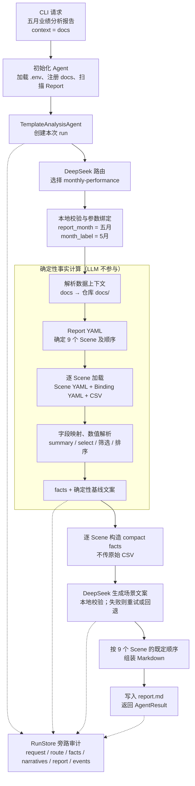
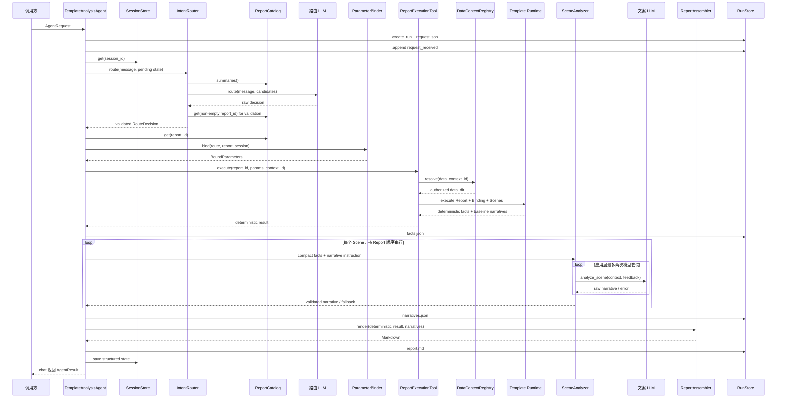

# Template Analysis Agent v6

`template-analysis-agent-v6` 是一个面向经营分析报告的模板驱动 Agent。它将系统拆成两部分：

- **确定性模板解释器**负责读取 CSV、映射字段、解析数值、执行筛选与排序，并产出可审计的事实；
- **Agent 执行引擎**负责自然语言路由、参数绑定、数据上下文授权、场景文案生成、失败回退、报告组装和运行审计。

核心原则是：**LLM 不读取原始 CSV、不计算指标、不决定业务阈值；业务规则尽量保留在 Report、Scene 和 Binding YAML 中。**

当前版本注册了一份完整的月度业绩报告，按以下顺序执行九个 Scene：

```text
标保 → 价值 → 活动人力 → 阳光人力 → 主管活动
→ 主管双星 → 标准组 → 新增 → 同引
```

## 1. 设计目标

### 模板与引擎解耦

新增指标、阈值、CSV 列映射或 Scene 时，正常情况下只修改 YAML 和确定性测试，不修改 `agent/` 或通用解释器。

### 事实先于文案

系统先生成 `facts.json`，再把经过裁剪的 compact facts 交给场景文案模型。场景文案生成失败时，可以回退到同一批事实生成的确定性基线文案。

### 完整报告级路由

Agent 路由的单位是已经注册的完整 Report，不临时创造 Report，也不根据用户请求动态裁剪或拼接 Scene。

### 关键阶段可审计

每个成功创建 run 目录并写入首批审计记录的请求都有独立的 `run_id`。完整成功运行保存请求、路由、事实、最终文案、报告和事件流；未完成运行保留失败前已经写入的产物，便于定位结果来源与失败阶段。该能力属于**结果级审计**：当前不保存 CSV 或模板的内容哈希、修改时间、有效 Scene 谓词/排序规则，也不持久化原始模型请求/响应及每次重试的完整详情，因此不能仅凭 run 目录严格复现输入版本。

请求规范化、run 目录创建、`request.json` 写入、首个 `request_received` 事件写入以及 Session 读取都位于 Engine 主保护区之外；这些步骤或 Agent 初始化失败时可能直接抛出异常，不保证产生最终 `failed` / `done` 事件。

## 2. 总体架构

以下架构图以这条在线命令的成功主链路为准：

```powershell
.venv\Scripts\python.exe template-analysis-agent-v6\standalone_agent.py `
  "请基于当前数据生成五月业绩分析报告" `
  --data-context-id docs
```

因为命令没有传入 `--offline`，路由和场景文案使用 DeepSeek；`docs` 只用于解析仓库根目录下已授权的 `docs/` 数据目录。图中不展开 `clarify`、`unsupported` 和 `failed` 等提前结束分支。



主链路可以概括为：**自然语言请求 → 选择整份 Report → 绑定月份参数 → 将 `docs` 解析为数据目录 → 按模板计算九个 Scene 的 facts → 基于 compact facts 生成文案 → 组装并保存 Markdown 报告**。实线是业务主链路，虚线是贯穿各阶段的审计写入。

其中只有“Report 路由”和“场景文案”调用 DeepSeek。所有 CSV 读取、字段映射、数值解析、阈值比较、筛选和排序都由确定性 Runtime 完成；DeepSeek 只能看到裁剪后的 compact facts，文案连续两次校验失败时使用 Runtime 同批 facts 生成的基线文案。

职责边界如下：

| 层 | 负责 | 不负责 |
| --- | --- | --- |
| Report | 报告参数、Scene 组成、顺序、输出格式 | CSV 物理列、具体筛选实现 |
| Scene | 指标语义、阈值、事实动作、文案目标 | 数据目录、CSV 文件选择 |
| Binding | CSV 文件、编码、总计行、语义字段到物理列的映射 | 业务阈值和报告顺序 |
| Runtime | 通用加载、解析、`summary`、`select`、排序、基线文案 | 具体业务指标或机构规则 |
| Agent | 路由、参数、授权上下文、编排、校验、回退、审计 | 重新计算 facts |
| LLM | 选择已有 Report、基于 compact facts 组织文案 | 读取 CSV、计算或补造数字 |

## 3. 项目结构

```text
template-analysis-agent-v6/
├─ .gitignore
├─ standalone_agent.py
├─ requirements.txt
├─ agent/
│  ├─ __init__.py
│  ├─ engine.py                 # 串行过程编排、事件与早停分支
│  ├─ router.py                 # 路由校验、月份标准化、参数绑定
│  ├─ catalog.py                # Report 目录与 Scene 按需加载
│  ├─ tools.py                  # 数据上下文和唯一报告执行工具
│  ├─ analyzer.py               # compact facts、文案校验、重试与回退
│  ├─ llm.py                    # Fake / DeepSeek 适配器
│  ├─ store.py                  # run 审计文件与进程内 Session
│  └─ models.py                 # 请求、路由、事件、结果等契约
├─ skills/monthly-performance-analysis/
│  ├─ SKILL.md
│  ├─ agents/
│  │  └─ openai.yaml
│  ├─ references/
│  │  ├─ reports/
│  │  │  └─ monthly-performance.yaml
│  │  ├─ bindings/
│  │  │  └─ monthly-csv.yaml
│  │  └─ scenes/
│  │     └─ *.yaml              # 当前九个 Scene
│  └─ scripts/
│     ├─ requirements.txt
│     ├─ run_report.py          # 绕过 Agent 的模板直跑入口
│     └─ monthly_analysis/
│        ├─ __init__.py
│        └─ runtime.py          # 最小确定性解释器
├─ tests/
│  ├─ test_minimal_runtime.py
│  ├─ test_router.py
│  ├─ test_agent_engine.py
│  └─ test_agent_e2e.py
├─ output/                      # 模板直跑时按需创建
└─ runs/                        # Agent 运行时生成；默认被 .gitignore 忽略
```

`output/` 不是必备的已提交目录；只有直跑入口实际写入该路径时才会创建。

## 4. 快速开始

以下命令均从仓库根目录执行。

### 4.1 安装依赖

```powershell
.venv\Scripts\python.exe -m pip install `
  -r template-analysis-agent-v6\requirements.txt
```

### 4.2 离线执行

离线模式使用确定性的 `FakeLLMClient`，适合开发、测试和闭环验证：

```powershell
.venv\Scripts\python.exe template-analysis-agent-v6\standalone_agent.py `
  "请基于当前数据生成五月业绩分析报告" `
  --offline `
  --data-context-id docs
```

默认情况下，只要仓库根目录存在 `docs/`，初始化逻辑就会自动注册：

```text
data_context_id: docs
physical path:   <repository-root>/docs
```

非流式模式只在终端打印最终 `AgentResult`。完整中间过程仍会写入 `runs/<run_id>/events.jsonl`。

### 4.3 查看事件流

```powershell
.venv\Scripts\python.exe template-analysis-agent-v6\standalone_agent.py `
  "请基于当前数据生成五月业绩分析报告" `
  --offline `
  --data-context-id docs `
  --stream
```

`--stream` 会把每个 `AgentEvent` 作为一行 JSON 输出。进入 Engine 主保护区且异常能被正常捕获时，最后一行事件类型为 `done`；初始化、请求构造或首批 run 写入失败时可能直接抛出，不保证有 `done`。

### 4.4 使用自定义数据目录

```powershell
.venv\Scripts\python.exe template-analysis-agent-v6\standalone_agent.py `
  "生成五月业绩分析报告" `
  --offline `
  --data-context-id custom `
  --data-dir docs
```

`--data-dir` 会把目录注册到当前 `--data-context-id`。目录必须存在；当前 `initialize_agent()` 固定只允许仓库根目录及其子目录，因此这个 CLI 不能注册仓库外的数据目录。

### 4.5 在线 DeepSeek 模式

不传 `--offline` 时使用 `DeepSeekLLMClient`。在仓库根目录 `.env` 中配置：

```dotenv
DEEPSEEK_API_KEY=your-api-key
DEEPSEEK_MODEL=deepseek-v4-flash
DEEPSEEK_BASE_URL=https://api.deepseek.com
```

然后执行：

```powershell
.venv\Scripts\python.exe template-analysis-agent-v6\standalone_agent.py `
  "请基于当前数据生成五月业绩分析报告" `
  --data-context-id docs
```

在线与离线模式共享同一套确定性 facts、校验、报告组装和审计链路，区别只在 Report 路由和 Scene 文案客户端。

DeepSeek 客户端在 Agent 初始化阶段创建；缺少 API key、依赖导入失败等初始化错误发生在 run 审计链路之前，不会生成 `run_id`。

### 4.6 绕过 Agent，直接验证模板

只验证 Report、Scene、Binding 和 CSV 时，可以运行：

```powershell
.venv\Scripts\python.exe `
  template-analysis-agent-v6\skills\monthly-performance-analysis\scripts\run_report.py `
  --data-dir docs `
  --output-dir template-analysis-agent-v6\output `
  --param report_month=五月 `
  --param month_label=5月 `
  --param quarter_label=二季度
```

该入口不经过 Agent 或 LLM，只生成：

```text
monthly-performance.facts.json
monthly-performance.md
```

成功时会在 stdout 输出 `status: completed` 和两个文件路径，退出码为 `0`。入口明确捕获的 `TemplateExecutionError`、`OSError` 和自定义 `--param` 语法错误会在 stderr 输出 `status: failed`，退出码为 `1`；命令行选项错误由 `argparse` 返回 `2`。该最小入口没有兜底捕获所有原生异常，例如格式字符串错误或混合类型排序产生的部分 `ValueError` / `TypeError` 仍可能直接带 traceback 退出。

## 5. 数据要求

当前完整 Report 需要同一数据目录中的九张 CSV：

| Scene ID | 标题 | CSV | 总计行 |
| --- | --- | --- | --- |
| `standard-premium` | 标保 | `标保.csv` | `片区 = 全系统` |
| `value` | 价值 | `价值.csv` | `片区 = 全系统` |
| `active-manpower` | 活动人力 | `活动人力.csv` | `片区 = 全系统` |
| `sunshine-manpower` | 阳光人力 | `阳光人力.csv` | `片区 = 全系统` |
| `supervisor-activity` | 主管活动 | `主管活动.csv` | `分组 = 全系统` |
| `supervisor-double-star` | 主管双星 | `主管双星.csv` | `分组 = 全系统` |
| `standard-team` | 标准组 | `标准组.csv` | `分组 = 全系统` |
| `recruitment` | 新增 | `新增.csv` | `分组 = 全系统` |
| `co-recruitment` | 同引 | `同引.csv` | `分组 = 全系统` |

Binding 当前声明 `utf-8-sig` 编码。运行时会裁剪表头和单元格首尾空格，因此普通 UTF-8 文件也可由该编码读取。

缺文件、缺少 Binding 最终绑定到的列、重复表头或行列数不一致都会直接失败；执行 `summary` 时，总计行数量异常也会失败。若错误的月份/季度前缀对应列恰好也存在，Runtime 会正常读取该列，并不会判断它是否符合用户请求。当前九个 Scene 都包含 `summary`，因此都必须有且只有一条总计行。系统不会补造 facts。

## 6. 模板结构设计

模板由 Report、Scene 和 Binding 三层组成。三者通过稳定的 ID 和语义字段连接：

```text
Report section.scene
        │
        ├──> Scene.id
        │       └── analysis 使用语义字段
        │
        └──> Binding.scenes[scene-id]
                └── 语义字段映射到 CSV 物理列
```

Python 运行时不会预定义 `month_rate`、`activity_count` 等具体字段名；执行 action 时，它按 action 引用的语义字段查找 Binding 映射，不硬编码 `5月达成率`、`活动人数` 等物理 CSV 列名。当前不会全量校验 `Scene.metrics` 与 `Binding.fields` 的集合一致性。

### 6.1 Report：报告组成与路由元数据

当前 Report 位于：

```text
skills/monthly-performance-analysis/references/reports/monthly-performance.yaml
```

核心结构：

```yaml
id: monthly-performance
title: "{report_month}业绩分析报告"
binding: monthly-csv

routing:
  scenario_desc: 基于月度经营 CSV 生成综合分析报告。
  intent_examples:
    - 生成五月业绩分析报告

parameters:
  report_month: 五月
  month_label: 5月
  quarter_label: 二季度

params_schema:
  report_month:
    type: string
    required: false
  month_label:
    type: string
    required: false
  quarter_label:
    type: string
    required: false

sections:
  - scene: standard-premium
  - scene: value
  # ...
  - scene: co-recruitment

output:
  format: markdown
  heading_level: 1
```

字段职责：

| 字段 | 含义 |
| --- | --- |
| `id` | Report 的稳定标识，供路由和执行工具引用 |
| `title` | 报告标题，可使用 Report 参数占位符 |
| `binding` | 对应 `references/bindings/<binding-id>.yaml` |
| `routing` | 提供给 ReportCatalog 和路由模型的摘要，不参与数值计算 |
| `parameters` | Report 默认参数 |
| `params_schema` | Agent 可接受参数的白名单；`required` 由 ParameterBinder 检查 |
| `sections` | Scene 组成、执行顺序和最终报告顺序 |
| `output` | 输出格式和报告标题级别 |

当前 Agent 路径会拒绝不在 `params_schema` 中的参数。`type` 目前仅是描述元数据，`ParameterBinder` 不读取它，也不实施类型校验；`required` 检查只可靠识别未提供或空字符串，显式 YAML/模型 `null` 当前不会被当作缺失值。

当前 Runtime 只接受 `type: csv` 的 Binding，并在加载 Binding 后立即拒绝其他类型。`output.format` 则到 `render_markdown()` 渲染阶段才校验；非 `markdown` 值不会阻止前面的 CSV 读取和 facts 计算，但最终无法渲染报告。

直接调用 `run_report.py --param` 时，参数会直接覆盖 Report defaults，不经过 Agent 的参数白名单、`required` 或类型检查；未知参数也会被保留在结果的 `parameters` 中，即使没有任何实际效果。所有 CLI 参数值都是字符串。因此生产入口应优先使用 Agent，模板直跑主要用于开发和确定性验证。

Report section 还可以覆盖某个 Scene 的默认阈值：

```yaml
sections:
  - scene: standard-premium
    parameters:
      high_rate: 75
```

Runtime 不校验 section override 的参数名是否已在 `Scene.parameters` 声明，也不校验类型；未知 key 会被静默接受。更重要的是，覆盖值会正确影响确定性 facts 和基线文案，但当前 Agent 在构造在线 compact context 时会重新读取基础 Scene 参数，导致 action 标题仍可能显示默认阈值。正式 Report 当前没有使用 section override；如需启用，应先补齐在线上下文传递与测试。若只要求最终文案正确，可暂用离线基线文案，但 `facts.json` 仍不保存有效覆盖规则。

ID 与文件的连接规则是：

- Report 的 `binding: X` 加载 `references/bindings/X.yaml`，且 YAML 内的 `id` 必须等于 `X`；
- Report 的 `section.scene: Y` 加载 `references/scenes/Y.yaml`，且 Scene 内的 `id` 必须等于 `Y`；
- Report 自身按 Catalog 扫描到的 YAML 加载，当前实现不要求 Report `id` 与文件名相同；
- 同一个 Scene 内的 action `id` 必须唯一；
- 当前实现不拒绝 Report 重复引用同一 Scene，但 Agent 文案结果以 `scene_id` 为 key，重复 Scene 会产生语义歧义，应把 section 中的 Scene ID 视为必须唯一。

### 6.2 Binding：语义字段到物理数据的适配层

Binding 位于：

```text
skills/monthly-performance-analysis/references/bindings/monthly-csv.yaml
```

一个 Scene 的 Binding 示例：

```yaml
id: monthly-csv
type: csv
encoding: utf-8-sig

scenes:
  standard-premium:
    file: 标保.csv
    organization_column: 机构
    total_row: {column: 片区, value: 全系统}
    fields:
      month_amount: "{month_label}达成"
      month_rate: "{month_label}达成率"
      month_yoy: "{month_label}同比"
      year_amount: 全年标保达成
      year_progress: 全年进度
      year_yoy: 全年同比
```

Binding 负责：

- 选择每个 Scene 使用的 CSV；
- 声明机构列；
- 声明总计行的识别规则；
- 把稳定语义字段映射到可能变化的 CSV 物理列；
- 使用 Report 参数适配月份、季度等列名前缀。

Binding 不应包含阈值、筛选名单或报告章节顺序。

数据授权目前只约束注册的 `data_dir`。Runtime 会直接计算 `data_dir / Binding.file`，尚未再次确认解析后的 CSV 路径仍位于该目录内；内置 Binding 使用可信的固定文件名，但不要把不可信或可越界的 Binding YAML 当作安全输入。

### 6.3 Scene：指标语义与确定性事实规则

Scene 位于：

```text
skills/monthly-performance-analysis/references/scenes/<scene-id>.yaml
```

一个完整的最小示例：

```yaml
id: supervisor-activity
title: 主管活动
description: 分析主管活动人数和活动率，识别领先与落后机构。

parameters:
  high_rate: 80
  low_rate: 60

metrics:
  in_service: {label: 在职主管, unit: 人}
  active_count: {label: 主管活动人数, unit: 人}
  activity_rate: {label: 主管活动率}
  activity_yoy: {label: 主管活动率同比}

analysis:
  - id: overall
    type: summary
    title: 全系统概况
    fields:
      - in_service
      - active_count
      - activity_rate
      - activity_yoy

  - id: high_activity_rate
    type: select
    title: 主管活动率高于 ${high_rate}% 的机构
    where: {field: activity_rate, operator: ">", value: "${high_rate}"}
    order_by: {field: activity_rate, direction: desc}
    display_field: activity_rate

  - id: low_activity_rate
    type: select
    title: 主管活动率低于 ${low_rate}% 的机构
    where: {field: activity_rate, operator: "<", value: "${low_rate}"}
    order_by: {field: activity_rate, direction: asc}
    display_field: activity_rate

narrative:
  objective: 概括全系统主管活动表现，并指出明显领先或落后的机构。
  style: 使用简洁的经营分析语言，先整体、后机构；只引用执行结果中的数字。
```

Scene 字段职责：

| 字段 | 含义 |
| --- | --- |
| `id` | 必须与 Report section 和 Binding scene key 对应 |
| `title` / `description` | 场景展示与模型上下文 |
| `parameters` | 场景级阈值和规则参数 |
| `metrics` | 语义字段的中文标签与单位 |
| `analysis` | 确定性 facts 的动作列表 |
| `narrative` | 在线场景文案的目标和风格指令 |

上表是职责说明，不是完整 Schema。当前 Runtime 在执行时零散校验必需字段和类型，而不是启动时做完整模板预验证；`metrics` 也不会与 Binding 的语义字段做全量集合校验，缺少 metric 定义时部分基线标签会退回字段名。

`narrative` 不会改变确定性 facts。通用解释器的基线文案由 `analysis`、`metrics` 和 facts 固定渲染；`narrative` 主要供 Agent 的 Scene 文案阶段使用。

### 6.4 两套参数占位符

模板中有两套语法，不能混用：

| 语法 | 参数域 | 使用位置 | 示例 |
| --- | --- | --- | --- |
| `{name}` | Report 参数 | 报告标题、CSV 文件名、Binding `fields` 物理列名 | `{month_label}达成率` |
| `${name}` | Scene 参数 | Scene action 标题、`where.value` 阈值 | `${high_rate}` |

Report 参数解析：

```text
Report.parameters defaults
  < Agent Session 中已声明参数
  < 本次路由提取参数
```

确定性 runtime 直跑时，则是：

```text
Report.parameters defaults < runtime_parameters
```

Scene 参数解析：

```text
Scene.parameters defaults < Report section.parameters overrides
```

`{name}` 由 Python `str.format_map` 处理，目前仅用于 Report 标题以及 Binding 的 `file`、`fields` 值，不解析 `encoding`、`organization_column` 或 `total_row`。字面花括号需写成 `{{` / `}}`；缺参数会转成模板错误，但其他非法格式字符串不一定被包装成 `TemplateExecutionError`。

`${name}` 的参数名需使用 ASCII 标识符形式；`where.value` 只有在整个字符串恰好是 `${name}` 时，才会被解析成原参数类型参与比较，Action 标题中的 `${name}` 则按文本替换。Scene YAML 和 section override 可保留数值类型。`run_report.py --param` 只覆盖 **Report 参数**，不能覆盖 Scene 阈值，并且接收的值都是字符串。

### 6.5 当前解释器能力

通用解释器只支持两种 action：

#### `summary`

从 Binding 指定的总计行读取字段：

```yaml
- id: overall
  type: summary
  fields: [activity_count, activity_rate, activity_yoy]
```

它不会对机构行重新求和。含 `summary` 的 Scene 必须恰好存在一条总计行；没有或存在多条都会失败。只含 `select` 的 Scene 不会触发这项数量校验。

#### `select`

按一个条件筛选非总计机构行：

```yaml
- id: high_activity_rate
  type: select
  where: {field: activity_rate, operator: ">", value: "${high_rate}"}
  order_by: {field: activity_rate, direction: desc}
  display_field: activity_rate
```

支持的比较运算符：

```text
>  >=  <  <=  =  is_empty
```

排序方向：

```text
asc  desc
```

`select` 固定排除总计行和机构名为空的行。`display_field` 默认取 `where.field`，`order_by.direction` 默认是 `asc`。没有 `order_by` 时保留 CSV 源顺序；排序键相同时也稳定保持源顺序；排序字段缺失的行排在有值行之后。普通比较遇到缺失值时均不匹配，只有 `is_empty` 会匹配缺失值。参与比较或排序的非缺失值必须彼此可比较；同一字段混合数字和普通文本时，筛选会转成模板错误，排序仍可能直接抛出原生 `TypeError`。

当前不支持：

- 多条件 `AND` / `OR`；
- 派生指标和表达式；
- 多表 Join；
- Top-N；
- 集合交集或差集；
- 在运行时动态计算总计行。

优先将复合业务描述拆成多个独立 `select` facts。例如：

- “新增本科未达标或缺失”拆成 `< 0` 与 `is_empty`；
- “月度送训挂零且季度达成挂零”拆成两个独立挂零事实，不推断交集。

只有出现多个 Scene 都需要的新能力时，才应考虑扩展通用 runtime。

### 6.6 `value` 与 `display` 双表示

每个 CSV 单元格会转换为：

```json
{
  "value": 71.3,
  "display": "71.3%"
}
```

- `value` 用于比较和排序；
- `display` 保存裁剪首尾空白后的源文本，用于文案与报告；
- `90%` 的 `value` 是 `90`，不是 `0.9`；
- `-1.1pt` 的 `value` 是 `-1.1`；
- 空字符串和 `-` 的 `value` 是 `null`；两者的 `display` 分别保留为 `""` 和 `"-"`，因此基线文案中空字符串显示为“缺失”，连字符仍显示为“-”；
- 带逗号的数字会先去除逗号再解析；
- 无法解析为数字的普通文本仍以字符串保留。

`metrics.unit` 会在 `summary` 基线文案中直接追加到 `display` 后；源数据的展示文本不应再包含相同单位，否则会出现重复单位。`select` 条目只展示源 `display`，不会追加 metric unit。

示例事实结构：

```json
{
  "overall": {
    "activity_count": {"value": 5531, "display": "5531"},
    "activity_rate": {"value": 77.9, "display": "77.9%"}
  },
  "high_activity_rate": [
    {
      "organization": "宁波",
      "values": {
        "activity_count": {"value": 13, "display": "13"},
        "activity_rate": {"value": 100, "display": "100.0%"}
      }
    }
  ]
}
```

`select` 的完整确定性结果保留该行全部语义字段。进入 LLM 前才进一步裁剪为 compact facts。

### 6.7 当前九个 Scene 的规则摘要

| Scene | 主要规则 |
| --- | --- |
| 标保 | 月达成率 `>70` / `<50`；全年进度 `>60` / `<45` |
| 价值 | 月达成率 `>85` / `<55` |
| 活动人力 | 达成率 `>90`；目标 `>=100`；低位 `<60` |
| 阳光人力 | 达成率 `>=90`；低位 `<70` |
| 主管活动 | 活动率 `>80` / `<60` |
| 主管双星 | 双星率 `>50` / `<25` |
| 标准组 | 同比 `<-20`；占比 `<30` |
| 新增 | 达成率 `>80`、`>=100`、`<40`；本科差额 `>=0` 达标、`>10pt` 超额、`<0` 未达标、`is_empty` 缺失 |
| 同引 | 季度达成率 `>=100`、`>=50`；月度送训与季度达成分别判断挂零 |

同一个机构可以同时出现在包含关系的 facts 中。例如 `>=100` 的机构也会出现在 `>80` 或 `>=50` 列表中。这是模板条件的直接结果，不由运行时做隐式去重。

## 7. Agent 执行引擎

Agent 的核心是 `agent/engine.py` 中的 `TemplateAnalysisAgent`。它是一个串行、事件化的过程编排器，使用 generator、`if` 分支和早停 `return` 推进流程；它不是由 `AgentState` 驱动并校验状态迁移的正式 FSM。业务执行能力只有 `ReportExecutionTool` 一个入口。

### 7.1 初始化与依赖装配

`standalone_agent.py:initialize_agent()` 完成：

1. 读取仓库根目录 `.env`；
2. 根据 `offline` 选择 `FakeLLMClient` 或 `DeepSeekLLMClient`；
3. 若仓库 `docs/` 存在且调用方未显式注册 `docs`，则自动注册默认数据上下文；
4. 动态加载 skill 中的 `execute_report()` 和 `render_markdown()`；
5. 加载 ReportCatalog；
6. 创建 IntentRouter、ParameterBinder、ReportExecutionTool；
7. 创建 SceneAnalyzer、ReportAssembler、RunStore 和 InMemorySessionStore；
8. 返回一个完全装配好的 `TemplateAnalysisAgent`。

这种装配方式使 `agent/` 不需要 import 具体的月报 Scene 或 CSV 字段。

### 7.2 端到端编排时序



上图展示 `execute` 成功路径；路由澄清/不支持、参数冲突/缺失以及缺数据上下文会提前结束。`events.jsonl` 并非在末尾一次写入，而是从 `request_received` 开始随各事件持续追加。`chat_stream()` 也会在每个事件写入后分阶段 yield，而不是到图末尾一次性返回。

详细步骤：

1. 规范化 `AgentRequest`；
2. 创建 `run_id` 和 run 目录；
3. 写 `request.json`，发出 `request_received`；
4. 从 SessionStore 读取当前会话；
5. 路由到已有 Report；
6. 绑定和标准化 Report 参数；
7. 解析受授权的 `data_context_id`；
8. 确定性执行完整 Report，写 `facts.json`；
9. 为每个 Scene 构造 compact facts；
10. 调用场景文案客户端，进行本地校验、重试或回退；
11. 写 `narratives.json`；
12. 将最终 narrative 注回确定性结果副本；
13. 渲染并写入 `report.md`；
14. 保存会话状态，发出 `report_ready` 与 `done`；
15. `chat()` 从 `done` 事件恢复并返回 `AgentResult`。

进入 Engine 主执行 `try` 后、且未被早期分支处理的异常，通常会变成 `failed` 和最终 `done` 事件。请求规范化、run 目录创建、`request.json` / 首个事件写入以及 Session 读取发生在保护范围外；这些步骤或 Agent 初始化失败时可能直接抛出。RunStore 写入本身也没有事务或恢复机制，若审计写入持续失败，不能保证补写最终事件。

### 7.3 ReportCatalog 与受限路由

`ReportCatalog` 启动时扫描 `references/reports/*.yaml`，加载轻量 `ReportDefinition`，不预载 Scene 或 Binding 正文。定义包含后续执行所需的模板路径，以及以下路由/参数元数据：

- Report ID 与标题；
- `routing.scenario_desc`；
- 意图示例；
- 默认参数和参数声明；
- Scene ID 列表。

Catalog 启动时不预载 Scene。facts 阶段由确定性 Runtime 按 Report sections 加载 Scene YAML；文案阶段 Catalog 再按 `scene_id` 加载 Scene 定义，用于构造 compact context。

路由输出契约：

```json
{
  "action": "execute | clarify | unsupported",
  "report_id": "candidate id or null",
  "confidence": 0.98,
  "extracted_params": {},
  "missing_params": [],
  "clarification": null,
  "reason": "short reason"
}
```

本地 `IntentRouter` 会再次校验：

- action 必须属于允许集合；
- confidence 必须在 `0..1`；
- 非空 report ID 必须存在于 Catalog；
- `execute` 必须包含 report ID；
- `execute` 置信度低于 `0.7` 时转换为 `clarify`。

模型或契约异常时，Engine 在应用层最多调用 Router 两次，即首次失败后重试一次。DeepSeek SDK 还配置了自己的内部重试，底层网络请求次数可能更多。

Engine 只具备完整 Report 执行能力，不会临时裁剪九场景月报。这不等于所有单 Scene 请求都会被可靠拒绝：当前 Fake 路由只显式识别“价值/标保”的部分单场景表达，其他如“只分析活动人力业绩”可能误路由到整份月报；DeepSeek 的分类也依赖模型输出。Engine 本身不二次识别“是否为单 Scene”。

本地校验会保证返回的 `report_id` 存在于整个 Catalog，但当前不会进一步验证它一定属于本轮传给模型的候选集。Session pending 时的候选约束主要依赖 LLMClient；如果候选 membership 是安全边界，应在 `IntentRouter` 增加本地校验。

### 7.4 参数绑定

`ParameterBinder` 的合并顺序是：

```text
Report 默认参数
  < 同一 Agent 会话中已有参数
  < 本轮路由显式提取参数
```

它还负责：

- 拒绝 `params_schema` 未声明的参数；
- 将“一月”到“十二月”和 `1月` 到 `12月` 规范化为成对的 `report_month/month_label`；
- 检测月份参数冲突；
- 检查 `required: true` 的参数；
- 最终只保留已声明参数。

当前 Fake 路由会从自然语言抽取月份，但不会自动推导季度。`quarter_label` 默认是 `二季度`，所以“七月”等请求如果成功走到含季度列的数据上，仍可能错误使用二季度列。DeepSeek 收到完整 `params_schema`，理论上可以输出 `quarter_label`，但提示词没有要求从月份推导季度，当前也没有相应保证或测试。现有 `AgentRequest`、`chat()` 和 CLI 没有直接参数字典入口；可靠设置非默认季度需要自定义 LLMClient 返回 `extracted_params`，或模板直跑时显式传 `--param quarter_label=...`。

### 7.5 数据上下文与执行工具

调用方给 Agent 的是逻辑 `data_context_id`，而不是由 LLM 决定的任意路径：

```text
docs -> <repository-root>/docs
```

`DataContextRegistry` 注册时会检查：

- ID 非空；
- 目录真实存在；
- 目录位于允许的数据根路径中。

Engine API 中，请求的 data context 优先于会话中保存的 context；两者都没有时返回 `needs_input`。CLI 以及 `standalone_agent.chat()` / `chat_stream()` 默认传入 `docs`，所以通常不会走缺上下文澄清；程序化调用不提供 context，或 CLI / API 传入空字符串等 falsy 值时会澄清。truthy 但未注册的 context ID 则会在 Tool 解析时失败。Registry 只在注册时检查目录；执行时 `resolve()` 不重新确认目录仍存在或仍满足允许根路径。

`ReportExecutionTool` 是 Agent 暴露的唯一业务执行能力。它再次检查参数白名单，解析授权目录，再调用通用 `execute_report()`。

### 7.6 确定性 facts 与 compact facts

Runtime 返回的完整 Scene 结果包含：

```json
{
  "scene_id": "supervisor-activity",
  "title": "主管活动",
  "source": ".../主管活动.csv",
  "facts": {},
  "narrative": "确定性基线文案",
  "warnings": []
}
```

Agent 不把完整 CSV 行直接发送给模型。`build_scene_context()` 会按 Scene actions 裁剪：

- `summary` 只保留 label、unit、value、display；
- `select` 只保留 organization 和 `display_field` 的 value/display；
- 同时传递 Scene 标题、描述、metrics、narrative instruction 和 Report 参数。

`SceneAnalyzer` 会把 compact facts 和 `baseline_narrative` 一起交给 LLMClient。内置 DeepSeek adapter 在发往在线模型前显式剔除 baseline，因此在线模型只看到模板选出的事实子集；Fake 和自定义 LLMClient 可以看到 baseline。内置客户端都不会接收原始 CSV 行。

完整 `facts.json` 当前保存结果和源文件绝对路径，但不保存每个 Scene 的有效参数、`where` / `operator` / `order_by` 或模板与 CSV 哈希。因此它能回答“结果是什么”，不能单独证明“当时按哪一版规则和输入得到结果”。当 Report section 覆盖 Scene 参数时，这也是覆盖规则不能从 `facts.json` 单独恢复的原因。

### 7.7 场景文案校验、重试与回退

场景文案必须满足 `SceneNarrativeResult`：

```json
{
  "scene_id": "supervisor-activity",
  "content": "- Markdown 场景文案",
  "used_fact_ids": ["overall", "high_activity_rate"],
  "warnings": []
}
```

本地校验包括：

1. `scene_id` 必须与输入一致；
2. `content` 不得为空；
3. `used_fact_ids` 列表不得为空；
4. `used_fact_ids` 只能包含 compact facts 中的 ID；
5. 对可识别的“机构（数字）”提及做机构范围检查。

当前校验不验证正文是否确实使用了 `used_fact_ids` 声明的每个事实，也不形式化验证正文中的每个数字。每个 Scene 在应用层默认最多调用 LLMClient 两次；第二次会把第一次失败信息——模型调用、解析或契约校验错误——作为 feedback 交给模型。DeepSeek SDK 还可能在单次调用内部重试。两次应用层调用都失败时：

- 使用 Runtime 生成的确定性 `baseline_narrative`；
- 记录 warning；
- 发出 `scene_analysis_fallback`；
- 最终报告状态为 `completed_with_warnings`，而不是整体 `failed`。

该校验显著限制机构和 fact 范围，但它不是对自然语言中每一个数字的形式化证明器。在线模型还依赖系统提示“数字照抄 display”。若要求文案不被模型改写，应使用 `--offline` 的基线文案或直接消费 `facts.json`；若要求规则与输入版本可独立复现，当前 `facts.json` 仍然不足。

模型成功返回的 `SceneNarrativeResult.warnings` 会保留在 `narratives.json`，但当前不会汇总到顶层 `AgentResult.warnings`，也不会触发 `completed_with_warnings`；顶层 warning 状态目前只由 fallback 产生。

### 7.8 Offline 与 DeepSeek 的差异

| 能力 | FakeLLMClient | DeepSeekLLMClient |
| --- | --- | --- |
| Report 路由 | 本地启发式规则匹配 | JSON 输出提示 + 本地解析/校验 |
| 月份提取 | 正则抽取 + ParameterBinder 标准化 | 模型抽取 + ParameterBinder 标准化/冲突检查 |
| Scene 文案 | 原样采用 baseline narrative | 基于 compact facts 改写 |
| facts 计算 | 确定性 Runtime | 同一个确定性 Runtime |
| 本地契约校验 | 有 | 有 |
| 重试与回退 | 有 | 有 |

Fake LLM 并不是跳过 Agent 的快捷路径。成功路由到月报后，离线运行仍执行参数绑定、数据授权、九个 Scene、facts 落盘、文案契约、报告组装和同样的结果级审计。

### 7.9 报告组装

`ReportAssembler` 会：

1. 深拷贝确定性执行结果；
2. 按 `scene_id` 将最终文案注入每个 Scene；
3. 确保每个 Scene 都有 narrative；
4. 调用同一个 `render_markdown()`；
5. 保持 Report sections 声明的顺序。

`output.heading_level` 当前允许 `1..5`。Report 标题使用该级别，Scene 标题使用下一级；当值为 `5` 时，Scene 标题是 Markdown 六级标题。

## 8. 事件、状态与审计产物

### 8.1 成功路径事件

```text
request_received
route_started
route_selected
parameters_bound
report_execution_started
scene_facts_ready × N
[scene_analysis_started → scene_analysis_ready / scene_analysis_fallback] × N
report_ready
done
```

分支事件：

- `clarification_required`：需要确认路由、解决月份冲突、补充必填参数或数据上下文；
- `unsupported`：没有匹配的完整 Report；
- `failed`：路由/模型契约、模板、数据、文案组装或审计写入等异常；
- 被主编排正常捕获且能继续写审计事件的分支最终以 `done` 结束。

事件时间为 UTC ISO 时间。`run_id` 由 UTC 时间戳和随机后缀组成。

当前 Runtime 会先在一次 `execute_report()` 中完成整份 Report，Engine 收到结果后才连续发出 N 个 `scene_facts_ready`。这些事件不是逐 CSV / 逐 Scene 的实时进度，且每个 `duration_ms` 都重复记录整份确定性 Report 的耗时。

### 8.2 AgentResult 状态

| 状态 | 含义 | CLI 退出码 |
| --- | --- | ---: |
| `completed` | 全部完成，无场景回退 warning | 0 |
| `completed_with_warnings` | 报告完成，至少一个 Scene 使用基线回退 | 0 |
| `needs_input` | 需要确认路由、解决参数冲突或补充参数/数据上下文 | 1 |
| `unsupported` | 没有匹配的完整 Report | 1 |
| `failed` | 路由、模型契约、模板、数据、组装或写盘异常 | 1 |

命令行参数本身不合法时由 `argparse` 返回退出码 2。

### 8.3 Run 目录

完整成功运行通常包含：

```text
runs/<run_id>/
├─ request.json
├─ route.json
├─ facts.json
├─ narratives.json
├─ report.md
└─ events.jsonl
```

| 文件 | 回答的问题 |
| --- | --- |
| `request.json` | 用户请求、Session ID 和数据上下文是什么？ |
| `route.json` | 选择了哪个 Report、提取了哪些参数？ |
| `facts.json` | 数字、筛选名单和排序结果是什么？（不含完整有效谓词、模板/输入版本） |
| `narratives.json` | 每个 Scene 使用了哪些 facts，是否回退？ |
| `report.md` | 最终输出是什么？ |
| `events.jsonl` | 执行在哪个阶段完成或失败？ |

未完成的 `needs_input`、`unsupported` 或 `failed` run 只包含失败/停止前已经写入的文件。`failed` 不一定发生在早期：确定性执行失败通常没有 `facts.json`，而文案或组装阶段失败可能已经存在 `facts.json`，甚至已有 `narratives.json`。

`output/` 是模板直跑生成目录，也可用于保存开发期示例快照；`runs/<run_id>/` 是某次 Agent 调用的结果级审计记录。

## 9. Session 与流式接口

只有提供 `session_id` 时，Agent 才可能保存以下结构化状态：

- 已选择 Report；
- 已收集的 Report 参数；成功绑定后是标准化参数，路由澄清阶段可能仍只是未经 Binder 验证的 `extracted_params`；
- 尚待补充的参数；
- 数据上下文 ID（路由级澄清分支当前不会保存本轮 context）。

Session 不保存聊天消息历史。只有已经识别 `report_id` 的路由澄清，或进入参数绑定/数据上下文阶段后的请求，才可能在**同一个 Agent 实例**中继续；没有 `report_id` 的澄清不会建立 pending 路由状态。成功运行会清空 `pending_parameters`，所以后续请求仍会重新面向整个 Catalog 路由，但保存的 Report 参数仍会参与 Binder 合并，请求未提供 context 时也仍可复用已保存的 context。

`InMemorySessionStore` 不持久化：

- 不跨进程；
- 不跨新建的 Agent 实例；
- 两次独立 CLI 调用即使使用相同 `--session-id`，也不能续接状态；一次性 CLI 中的该参数主要进入本次审计记录，真正的多轮续接只适用于复用同一 Agent 实例的程序调用。

`chat_stream()` 提供异步迭代外观并逐事件 `yield`，但内部仍执行同一个同步过程。当前 Scene 串行分析，确定性整报执行和 DeepSeek 的同步调用都会阻塞当前事件循环；它不是后台任务、实时 token stream、并行或真正非阻塞的执行器。

## 10. 如何新增一个 Scene

以下流程应当不修改 Agent 核心。

### 第一步：定义 Scene

新建：

```text
skills/monthly-performance-analysis/references/scenes/persistency.yaml
```

```yaml
id: persistency
title: 继续率
description: 分析继续率整体表现与高低机构。

parameters:
  high_rate: 90
  low_rate: 75

metrics:
  persistency_rate: {label: 继续率}
  persistency_yoy: {label: 继续率同比}

analysis:
  - id: overall
    type: summary
    title: 全系统概况
    fields: [persistency_rate, persistency_yoy]

  - id: high_rate
    type: select
    title: 继续率高于 ${high_rate}% 的机构
    where: {field: persistency_rate, operator: ">", value: "${high_rate}"}
    order_by: {field: persistency_rate, direction: desc}
    display_field: persistency_rate

  - id: low_rate
    type: select
    title: 继续率低于 ${low_rate}% 的机构
    where: {field: persistency_rate, operator: "<", value: "${low_rate}"}
    order_by: {field: persistency_rate, direction: asc}
    display_field: persistency_rate

narrative:
  objective: 概括整体继续率并指出明显领先或落后的机构。
  style: 先整体、后机构，只引用 facts 中的数字。
```

### 第二步：增加 Binding

在 `monthly-csv.yaml` 中添加同 ID 的映射：

```yaml
scenes:
  persistency:
    file: 继续率.csv
    organization_column: 机构
    total_row: {column: 分组, value: 全系统}
    fields:
      persistency_rate: 继续率
      persistency_yoy: 继续率同比
```

### 第三步：加入 Report

```yaml
sections:
  # ...
  - scene: persistency
```

加入位置决定执行和最终报告顺序。必要时可以在 section 中覆盖阈值。

请勿重复加入同一 `scene` ID；当前 Runtime 虽会重复执行，但 Agent 文案映射以 `scene_id` 为 key，无法可靠表达两个独立实例。

### 第四步：准备数据契约

确保：

- CSV 文件位于注册的数据目录；
- 表头裁剪后与 Binding 一致；
- 若 Scene 包含 `summary`，存在且只存在一条总计行；
- 百分比、pt、空值格式符合解析规则；
- 每行列数一致。

### 第五步：增加确定性测试

在 `tests/test_minimal_runtime.py` 中至少验证：

- Scene ID、标题和顺序；
- overall 数值与 display；
- 筛选名单和排序；
- `>` 与 `>=` 等严格边界；
- 总计行和空机构被排除；
- 缺失值行为；
- Markdown 中包含场景标题和关键事实。

同步更新 Agent 测试中的预期 Scene ID，并用 E2E 测试确认每个 Scene 都经过文案分析与组装。

### 第六步：验证两条闭环

模板直跑：

```powershell
.venv\Scripts\python.exe `
  template-analysis-agent-v6\skills\monthly-performance-analysis\scripts\run_report.py `
  --data-dir docs `
  --output-dir template-analysis-agent-v6\output `
  --param report_month=五月 `
  --param month_label=5月 `
  --param quarter_label=二季度
```

Agent 闭环：

```powershell
.venv\Scripts\python.exe template-analysis-agent-v6\standalone_agent.py `
  "生成五月业绩分析报告" `
  --offline `
  --data-context-id docs
```

## 11. 什么情况下应该修改哪一层

| 需求 | 修改位置 |
| --- | --- |
| 增加报告章节或改变顺序 | Report YAML |
| 调整阈值、指标标签、筛选或排序 | Scene YAML |
| CSV 改名或列名变化 | Binding YAML |
| 新增同结构 CSV Scene | Scene + Binding + Report + 测试 |
| 多个 Scene 都需要新的通用 action/operator | `runtime.py` + 通用解释器测试 |
| 新增 Report 路由策略或澄清流程 | Agent Router / Engine |
| 新的数据授权方式或工具能力 | DataContextRegistry / Tool 层 |
| 新的模型供应商 | LLMClient 适配器 |

不要把具体机构、阈值或业务字段写入 `agent/` 或 `runtime.py`。

## 12. 测试

运行完整测试：

```powershell
.venv\Scripts\python.exe -m unittest discover `
  -s template-analysis-agent-v6\tests `
  -v
```

测试分层：

| 文件 | 覆盖范围 |
| --- | --- |
| `test_minimal_runtime.py` | 关键 YAML/CSV 契约、facts、边界、排序、参数化列、Markdown |
| `test_router.py` | Catalog 摘要、路由校验、月份标准化、参数白名单 |
| `test_agent_engine.py` | 成功审计产物、重试回退、Session 续接、事件流和部分失败分支 |
| `test_agent_e2e.py` | 自然语言到九场景报告的完整离线闭环 |

真实 DeepSeek smoke 默认跳过。启用前还必须在仓库根 `.env` 配置有效 API key、安装在线依赖并确保网络可用；该测试会产生外部调用、耗时和费用。显式启用：

```powershell
$env:RUN_REAL_LLM_SMOKE = "1"
.venv\Scripts\python.exe -m unittest discover `
  -s template-analysis-agent-v6\tests `
  -v
```

当前基线为 33 项测试：32 项通过，1 项真实 DeepSeek smoke 默认跳过。

## 13. 当前限制与注意事项

- 当前只注册完整月度业绩 Report，不支持运行时动态裁剪或拼接 Scene；
- Fake 路由的单 Scene 拒绝规则目前只覆盖部分“价值/标保”表达，其他单 Scene 请求可能误执行整份月报；
- Runtime 当前只支持 CSV、`summary` 和单条件 `select`；
- `summary` 信任 CSV 中唯一的总计行，不从机构明细重新聚合；
- 月份标准化不会自动推导 `quarter_label`，非默认季度需要调用方可靠提供；
- Scene 分析按 Report 顺序串行执行；
- Session 仅存在于当前 Agent 实例内，且同一 Session 的整段读—改—写不是事务；并发请求可能覆盖彼此的结构化状态；
- 在线文案校验限制 fact 与机构范围，但不会形式化验证每个自然语言数字；
- `AgentState` 目前是未接入 Engine 的预留枚举，不构成运行时状态迁移或公共状态契约；其中 `needs_clarification` 也不同于公共结果状态 `needs_input`；
- Report section 的 Scene 参数覆盖会正确影响确定性 facts 和基线文案，但在线 compact context 的 action 标题仍使用基础 Scene 参数；正式 Report 当前未使用覆盖，启用前应修复上下文传递；
- `facts.json` 不保存有效 Scene 参数、筛选/排序谓词、CSV/模板哈希或修改时间，只提供结果级审计；
- Binding CSV 路径尚未在 Runtime 内二次限制于授权 `data_dir`，因此模板资源必须可信；
- Runtime/模板直跑仍有少数原生格式或混合类型异常未统一包装成 `TemplateExecutionError`；
- `scene_facts_ready` 当前在整报 facts 完成后批量发出，且 `duration_ms` 是整份 Report 的耗时；
- Router 只验证非空 `report_id` 存在于整个 Catalog，尚未本地验证其属于本轮候选集合；
- 当前测试未覆盖所有负向契约、路由/参数澄清、未知 context、审计写失败和并发 Session 情形；
- `run.md` 包含双场景、四场景到九场景的历史阶段样例，当前结构应以本 README、现有 YAML 和最新测试为准。

## 14. 推荐阅读顺序

1. `standalone_agent.py`：理解装配和 CLI；
2. `references/reports/monthly-performance.yaml`：理解报告组成；
3. `references/bindings/monthly-csv.yaml`：理解数据适配；
4. 任一 `references/scenes/*.yaml`：理解事实规则；
5. `scripts/monthly_analysis/runtime.py`：理解确定性解释器；
6. `agent/engine.py`：理解串行编排、事件和早停分支；
7. `agent/analyzer.py` 与 `agent/llm.py`：理解模型边界、校验和回退；
8. `tests/test_minimal_runtime.py` 与 `tests/test_agent_e2e.py`：理解系统最终契约。

更详细、带真实中间产物的历史执行链路见上一级仓库根目录 `../run.md`；其中包含双场景、四场景阶段记录，当前行为应以本 README、现有 YAML 和最新测试为准。
